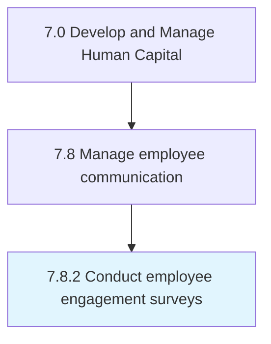
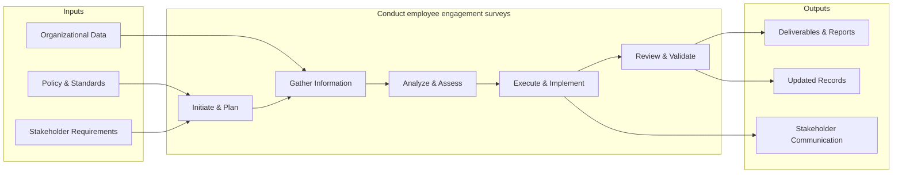

# Conduct employee engagement surveys

> Questioning employees to ascertain overall workplace satisfaction.

## Overview

Process 7.8.2 is a core process that defines the specific procedures for conduct employee engagement surveys. 

Questioning employees to ascertain overall workplace satisfaction.

This process manages the execution of employee engagement surveys. It involves planning activities, preparing resources, conducting sessions, documenting outcomes, and following up on action items to ensure comprehensive completion.

## Process Hierarchy



## Key Statistics

| Metric | Value |
|--------|-------|
| APQC Code | 16944 |
| Hierarchy ID | 7.8.2 |
| Level | Process |
| Parent | [7.8](../) |
| Sub-Processes | 0 |


## GraphDL Semantic Structure

```graphdl
conduct.EmployeeEngagementSurveys
```

| Component | Value | Description |
|-----------|-------|-------------|
| Verb | `conduct` | Primary action |
| Object | `employee engagement surveys` | Direct object |


## Related Concepts

- EmployeeEngagementSurveys


## Process Flow



## RACI Matrix

| Activity | Responsible | Accountable | Consulted | Informed |
|----------|------------|-------------|-----------|----------|
| Develop comms plan | HR Communications Specialist | HR Director | Corporate Comms | All Employees |
| Conduct engagement survey | HR Analyst | HR Director | Management | All Employees |
| Deliver communications | HR Communications Specialist | HR Director | Legal | All Employees |

## Related Occupations

- [Human Resources Managers](/occupations/Management/HumanResourcesManagers)
- [Public Relations Specialists](/occupations/ArtsMedia/PublicRelationsSpecialists)
- [Human Resources Specialists](/occupations/Business/Operations/HumanResourcesSpecialists)
- [Training and Development Specialists](/occupations/Business/TrainingAndDevelopmentSpecialists)
- [Management Analysts](/occupations/Business/Operations/ManagementAnalysts)

## Related Departments

- Human Resources
- Corporate Communications
- Information Technology

## Industry Variations

### Technology

Uses digital-first communication channels, async collaboration tools, all-hands meetings, and transparent internal knowledge bases.

### Healthcare

Requires multi-shift communication strategies, clinical vs. administrative messaging channels, and urgent safety communication protocols.

### Retail

Manages communication across distributed store locations, frontline mobile apps, seasonal workforce messaging, and multilingual communications.

## KPIs & Metrics

| Metric | Description | Target |
|--------|-------------|--------|
| Communication Reach Rate | Percentage of employees receiving key communications | > 95% |
| Employee Engagement Score | Annual engagement survey composite score | > 4.0/5.0 |
| Survey Response Rate | Percentage of employees completing engagement surveys | > 80% |
| Internal Communication Satisfaction | Employee rating of communication effectiveness | > 3.8/5.0 |

---

*Source: APQC PCF 16944 (7.8.2) - APQC*
