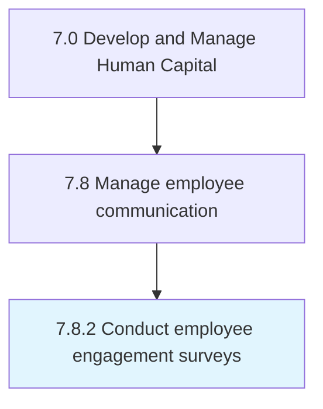

# Conduct employee engagement surveys

> Questioning employees to ascertain overall workplace satisfaction.

## Overview

Process 7.8.2 is a core process that defines the specific procedures for conduct employee engagement surveys. 

Questioning employees to ascertain overall workplace satisfaction.

## Process Hierarchy



## Key Statistics

| Metric | Value |
|--------|-------|
| APQC Code | 16944 |
| Hierarchy ID | 7.8.2 |
| Level | Process |
| Parent | [7.8](../) |
| Sub-Processes | 0 |


## GraphDL Semantic Structure

```
conduct.EmployeeEngagementSurveys
```

| Component | Value | Description |
|-----------|-------|-------------|
| Verb | `conduct` | Primary action |
| Object | `employee engagement surveys` | Direct object |


## Related Concepts

- EmployeeEngagementSurveys


---

*Source: APQC PCF 16944 (7.8.2) - APQC*
