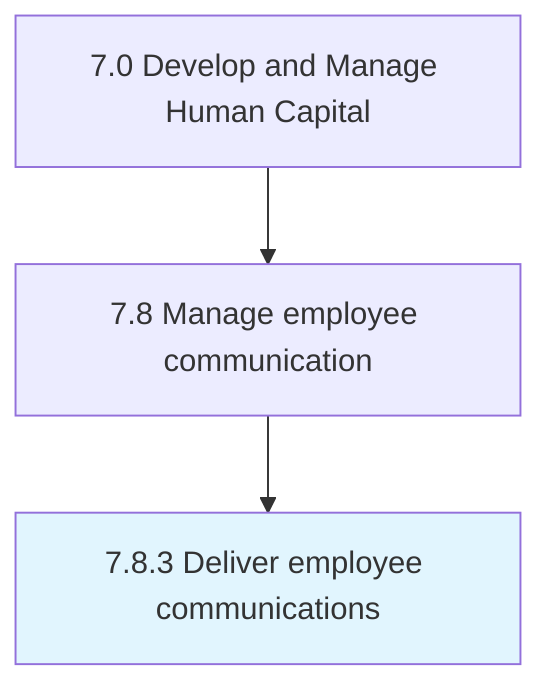

# Deliver employee communications

> Implementing the communication plan for employees.

## Overview

Process 7.8.3 is a core process that defines the specific procedures for deliver employee communications. 

Implementing the communication plan for employees. Initiate dialogues and engagement by monitoring the exchange of ideas and opinions, the development of personal relationships, etc.

## Process Hierarchy



## Key Statistics

| Metric | Value |
|--------|-------|
| APQC Code | 10532 |
| Hierarchy ID | 7.8.3 |
| Level | Process |
| Parent | [7.8](../) |
| Sub-Processes | 0 |


## GraphDL Semantic Structure

```
deliver.EmployeeCommunications
```

| Component | Value | Description |
|-----------|-------|-------------|
| Verb | `deliver` | Primary action |
| Object | `employee communications` | Direct object |


## Related Concepts

- EmployeeCommunications


---

*Source: APQC PCF 10532 (7.8.3) - APQC*
