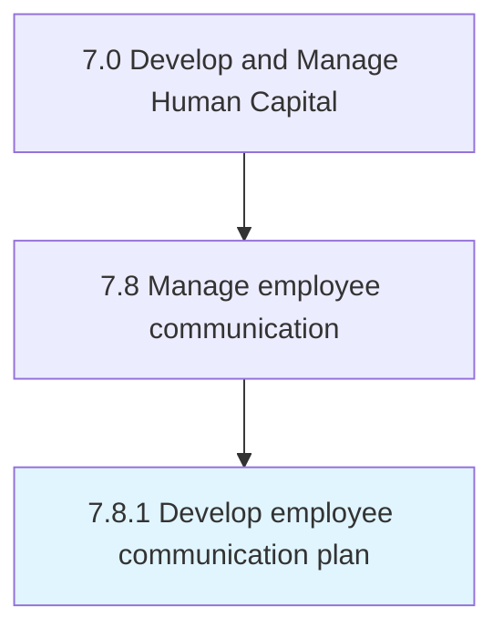
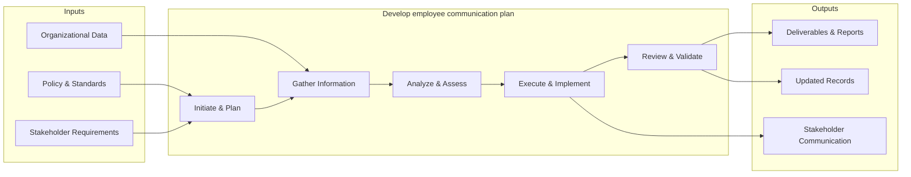

# Develop employee communication plan

> Creating a plan for managing communication among employees.

## Overview

Process 7.8.1 is a core process that defines the specific procedures for develop employee communication plan. 

Creating a plan for managing communication among employees. Inform employees of direction. Counter resistance with change management approaches. Seek specific areas of input to the decision-making process. Seek varying degrees of involvement and co-creation.

This process encompasses the end-to-end development of employee communication plan, from initial needs assessment through design, implementation, and evaluation. It requires cross-functional collaboration, alignment with organizational objectives, and iterative refinement based on stakeholder feedback and performance metrics.

## Process Hierarchy



## Key Statistics

| Metric | Value |
|--------|-------|
| APQC Code | 10529 |
| Hierarchy ID | 7.8.1 |
| Level | Process |
| Parent | [7.8](../) |
| Sub-Processes | 0 |


## GraphDL Semantic Structure

```graphdl
develop.EmployeeCommunicationPlan
```

| Component | Value | Description |
|-----------|-------|-------------|
| Verb | `develop` | Primary action |
| Object | `employee communication plan` | Direct object |


## Related Concepts

- EmployeeCommunicationPlan


## Process Flow



## RACI Matrix

| Activity | Responsible | Accountable | Consulted | Informed |
|----------|------------|-------------|-----------|----------|
| Develop comms plan | HR Communications Specialist | HR Director | Corporate Comms | All Employees |
| Conduct engagement survey | HR Analyst | HR Director | Management | All Employees |
| Deliver communications | HR Communications Specialist | HR Director | Legal | All Employees |

## Related Occupations

- [Human Resources Managers](/occupations/Management/HumanResourcesManagers)
- [Public Relations Specialists](/occupations/ArtsMedia/PublicRelationsSpecialists)
- [Human Resources Specialists](/occupations/Business/Operations/HumanResourcesSpecialists)
- [Training and Development Specialists](/occupations/Business/TrainingAndDevelopmentSpecialists)
- [Management Analysts](/occupations/Business/Operations/ManagementAnalysts)

## Related Departments

- Human Resources
- Corporate Communications
- Information Technology

## Industry Variations

### Technology

Uses digital-first communication channels, async collaboration tools, all-hands meetings, and transparent internal knowledge bases.

### Healthcare

Requires multi-shift communication strategies, clinical vs. administrative messaging channels, and urgent safety communication protocols.

### Retail

Manages communication across distributed store locations, frontline mobile apps, seasonal workforce messaging, and multilingual communications.

## KPIs & Metrics

| Metric | Description | Target |
|--------|-------------|--------|
| Communication Reach Rate | Percentage of employees receiving key communications | > 95% |
| Employee Engagement Score | Annual engagement survey composite score | > 4.0/5.0 |
| Survey Response Rate | Percentage of employees completing engagement surveys | > 80% |
| Internal Communication Satisfaction | Employee rating of communication effectiveness | > 3.8/5.0 |

---

*Source: APQC PCF 10529 (7.8.1) - APQC*
