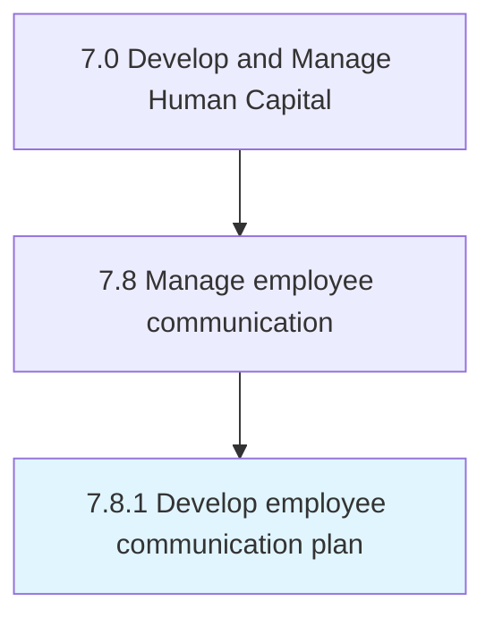

# Develop employee communication plan

> Creating a plan for managing communication among employees.

## Overview

Process 7.8.1 is a core process that defines the specific procedures for develop employee communication plan. 

Creating a plan for managing communication among employees. Inform employees of direction. Counter resistance with change management approaches. Seek specific areas of input to the decision-making process. Seek varying degrees of involvement and co-creation.

## Process Hierarchy



## Key Statistics

| Metric | Value |
|--------|-------|
| APQC Code | 10529 |
| Hierarchy ID | 7.8.1 |
| Level | Process |
| Parent | [7.8](../) |
| Sub-Processes | 0 |


## GraphDL Semantic Structure

```
develop.EmployeeCommunicationPlan
```

| Component | Value | Description |
|-----------|-------|-------------|
| Verb | `develop` | Primary action |
| Object | `employee communication plan` | Direct object |


## Related Concepts

- EmployeeCommunicationPlan


---

*Source: APQC PCF 10529 (7.8.1) - APQC*
