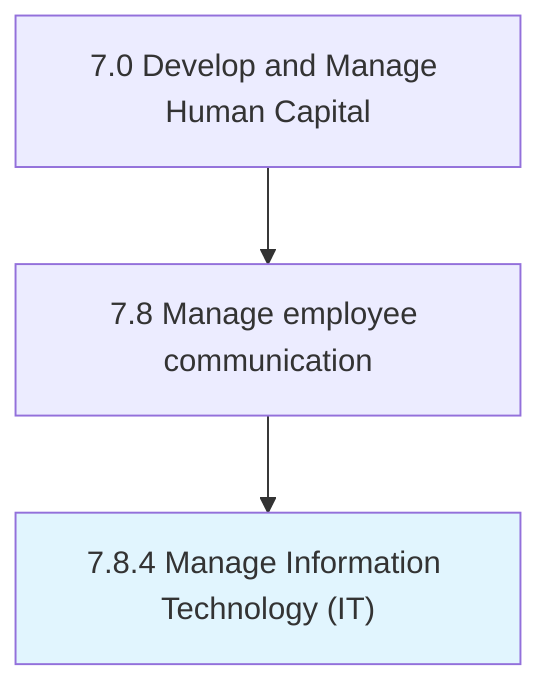

# Manage Information Technology (IT)

> Managing process groups relevant to the business of information technology within an organization.

## Overview

Process 7.8.4 is a core process that defines the specific procedures for manage information technology (it). 

Managing process groups relevant to the business of information technology within an organization. The process groups include "Develop and manage IT customer relationships", "Develop and manage IT business strategy", " Develop and manage IT resilience and risk", " Manage information", " Develop and manage services/solutions", "Deploy services/solutions", and " Create and manage support services/solutions".

## Process Hierarchy



## Key Statistics

| Metric | Value |
|--------|-------|
| APQC Code | 20607 |
| Hierarchy ID | 7.8.4 |
| Level | Process |
| Parent | [7.8](../) |
| Sub-Processes | 0 |


## GraphDL Semantic Structure

```
manage.InformationTechnologyIT
```

| Component | Value | Description |
|-----------|-------|-------------|
| Verb | `manage` | Primary action |
| Object | `Information Technology (IT)` | Direct object |


---

*Source: APQC PCF 20607 (7.8.4) - APQC*
