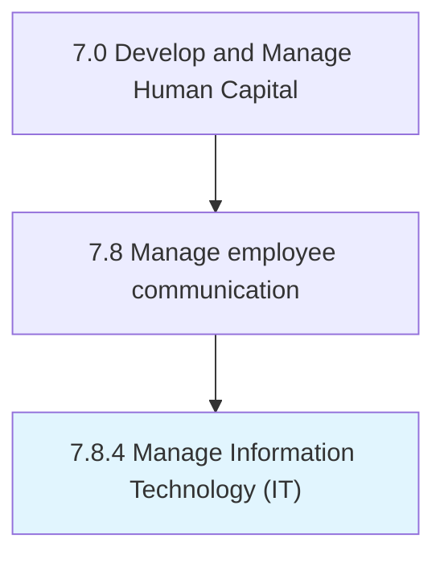
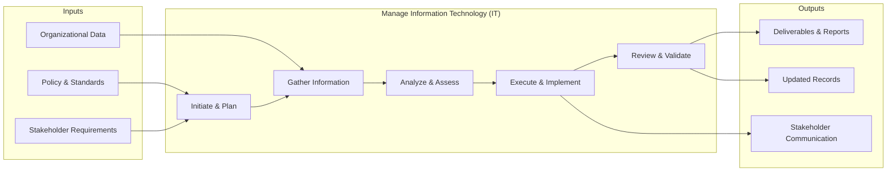

# Manage Information Technology (IT)

> Managing process groups relevant to the business of information technology within an organization.

## Overview

Process 7.8.4 is a core process that defines the specific procedures for manage information technology (it). 

Managing process groups relevant to the business of information technology within an organization. The process groups include "Develop and manage IT customer relationships", "Develop and manage IT business strategy", " Develop and manage IT resilience and risk", " Manage information", " Develop and manage services/solutions", "Deploy services/solutions", and " Create and manage support services/solutions".

This process provides a structured approach to managing information technology i t across the organization. It includes establishing governance frameworks, defining operational procedures, monitoring performance, ensuring compliance with policies and regulations, and driving continuous improvement through data-driven insights.

## Process Hierarchy



## Key Statistics

| Metric | Value |
|--------|-------|
| APQC Code | 20607 |
| Hierarchy ID | 7.8.4 |
| Level | Process |
| Parent | [7.8](../) |
| Sub-Processes | 0 |


## GraphDL Semantic Structure

```graphdl
manage.InformationTechnologyIT
```

| Component | Value | Description |
|-----------|-------|-------------|
| Verb | `manage` | Primary action |
| Object | `Information Technology (IT)` | Direct object |


## Process Flow



## RACI Matrix

| Activity | Responsible | Accountable | Consulted | Informed |
|----------|------------|-------------|-----------|----------|
| Develop comms plan | HR Communications Specialist | HR Director | Corporate Comms | All Employees |
| Conduct engagement survey | HR Analyst | HR Director | Management | All Employees |
| Deliver communications | HR Communications Specialist | HR Director | Legal | All Employees |

## Related Occupations

- [Human Resources Managers](/occupations/Management/HumanResourcesManagers)
- [Public Relations Specialists](/occupations/ArtsMedia/PublicRelationsSpecialists)
- [Human Resources Specialists](/occupations/Business/Operations/HumanResourcesSpecialists)
- [Training and Development Specialists](/occupations/Business/TrainingAndDevelopmentSpecialists)
- [Management Analysts](/occupations/Business/Operations/ManagementAnalysts)

## Related Departments

- Human Resources
- Corporate Communications
- Information Technology

## Industry Variations

### Technology

Uses digital-first communication channels, async collaboration tools, all-hands meetings, and transparent internal knowledge bases.

### Healthcare

Requires multi-shift communication strategies, clinical vs. administrative messaging channels, and urgent safety communication protocols.

### Retail

Manages communication across distributed store locations, frontline mobile apps, seasonal workforce messaging, and multilingual communications.

## KPIs & Metrics

| Metric | Description | Target |
|--------|-------------|--------|
| Communication Reach Rate | Percentage of employees receiving key communications | > 95% |
| Employee Engagement Score | Annual engagement survey composite score | > 4.0/5.0 |
| Survey Response Rate | Percentage of employees completing engagement surveys | > 80% |
| Internal Communication Satisfaction | Employee rating of communication effectiveness | > 3.8/5.0 |

---

*Source: APQC PCF 20607 (7.8.4) - APQC*
