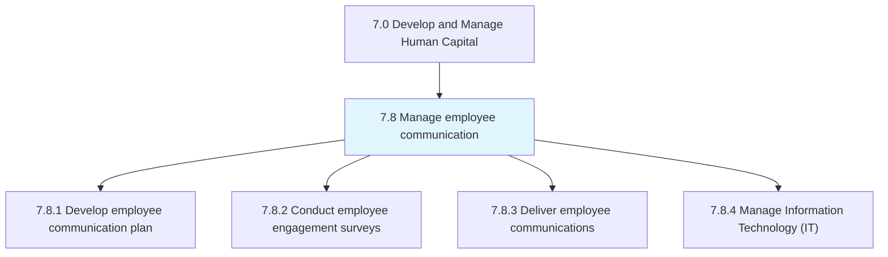
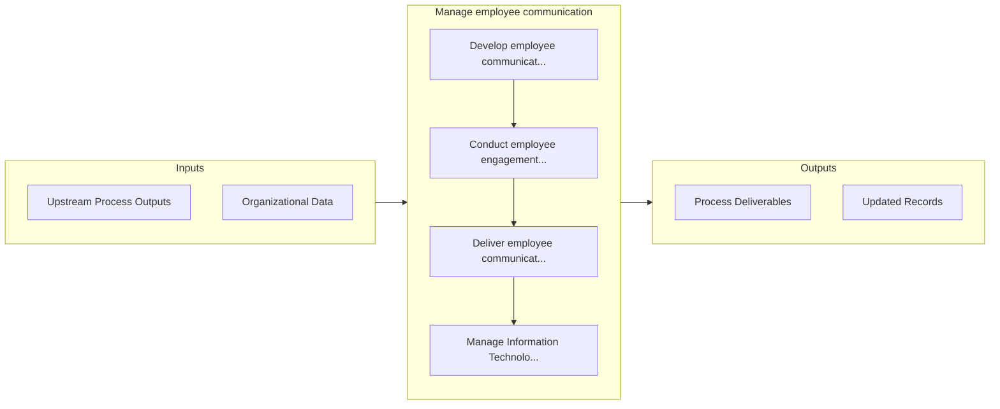

# Manage employee communication

> Creating an effective plan that initiates and promotes communication and engagement among the employees and between employees and management.

## Overview

Group 7.8 is a process group within APQC Category 7.0 (Develop and Manage Human Capital). 

Creating an effective plan that initiates and promotes communication and engagement among the employees and between employees and management.

## Process Hierarchy



## Key Statistics

| Metric | Value |
|--------|-------|
| APQC Code | 21451 |
| Hierarchy ID | 7.8 |
| Level | Group |
| Parent | [7](../) |
| Sub-Processes | 4 |


## GraphDL Semantic Structure

```
manage.EmployeeCommunication
```

| Component | Value | Description |
|-----------|-------|-------------|
| Verb | `manage` | Primary action |
| Object | `employee communication` | Direct object |


## Process Flow



## Sub-Processes

| Process | Hierarchy ID | Description |
|---------|-------------|-------------|
| [Develop employee communication plan](./DevelopEmployeeCommunicationPlan) | 7.8.1 | Creating a plan for managing communication among employees |
| [Conduct employee engagement surveys](./ConductEmployeeEngagementSurveys) | 7.8.2 | Questioning employees to ascertain overall workplace satisfaction |
| [Deliver employee communications](./DeliverEmployeeCommunications) | 7.8.3 | Implementing the communication plan for employees |
| [Manage Information Technology (IT)](./ManageInformationTechnologyIT) | 7.8.4 | Managing process groups relevant to the business of information technology within an organization |


## Related Concepts

- [EmployeeCommunication](/concepts/EmployeeCommunication)


---

*Source: APQC PCF 21451 (7.8) - APQC*
