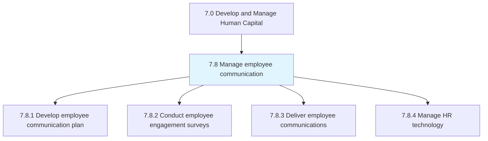
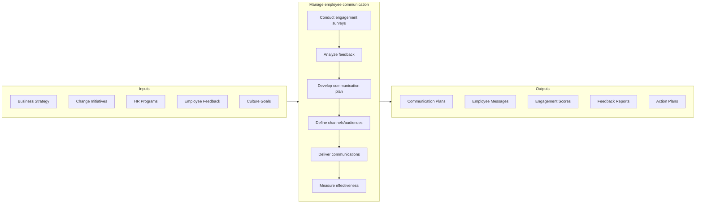

# Manage employee communication

> Creating an effective plan that initiates and promotes communication and engagement among the employees and between employees and management.

## Overview

Group 7.8 is a process group within [Develop and Manage Human Capital](../) that establishes the foundation for effective internal communication throughout the organization. This process group ensures employees are informed, engaged, and connected to the organization's mission, strategy, and culture.

Effective employee communication goes beyond one-way information sharing to create genuine dialogue between leadership and employees. Modern approaches leverage multiple channels (intranet, mobile apps, video, town halls, manager cascades), enable two-way feedback, personalize content for different audiences, and measure communication effectiveness. When done well, employee communication builds trust, alignment, engagement, and a sense of belonging.

## Process Hierarchy



## Key Statistics

| Metric | Value |
|--------|-------|
| APQC Code | 21451 |
| Hierarchy ID | 7.8 |
| Level | Group |
| Parent | [7](../) |
| Sub-Processes | 4 |

## GraphDL Semantic Structure

```graphdl
manage.EmployeeCommunication
```

| Component | Value | Description |
|-----------|-------|-------------|
| Verb | `manage` | Primary action of directing and coordinating |
| Object | `EmployeeCommunication` | Internal organizational messaging |

## Process Flow



## Child Processes

| Process | Hierarchy ID | Description |
|---------|-------------|-------------|
| [Develop employee communication plan](./DevelopEmployeeCommunicationPlan) | 7.8.1 | Creating strategic communication frameworks and calendars |
| [Conduct employee engagement surveys](./ConductEmployeeEngagementSurveys) | 7.8.2 | Measuring employee satisfaction, engagement, and feedback |
| [Deliver employee communications](./DeliverEmployeeCommunications) | 7.8.3 | Executing communication through multiple channels |
| [Manage HR technology](./ManageInformationTechnologyIT) | 7.8.4 | Administering communication platforms and tools |

## RACI Matrix

| Activity | Responsible | Accountable | Consulted | Informed |
|----------|-------------|-------------|-----------|----------|
| Develop communication strategy | Internal Communications | CHRO | Leadership, Marketing | All Employees |
| Plan communication calendar | Internal Comms | HR Director | Business Units | Managers |
| Conduct engagement surveys | HR Analytics | CHRO | Survey Vendor | All Employees |
| Analyze survey results | HR Analytics | HR Director | Leadership | All Employees |
| Deliver executive communications | Internal Comms | CEO/CHRO | Legal | All Employees |
| Manage communication tools | HR Technology | HR Director | IT | All Employees |

## Key Stakeholders

- **Internal Communications Team**: Designs and executes communication strategy
- **HR Leadership**: Sponsors employee communication initiatives
- **Executive Team**: Provides leadership voice and visibility
- **Managers**: Cascades messages and enables dialogue
- **Employees**: Recipients and contributors to communication
- **IT**: Supports communication technology platforms

## Metrics and KPIs

| Metric | Description | Target |
|--------|-------------|--------|
| Employee Engagement Score | Annual/pulse survey engagement measure | >75% |
| Communication Reach | Percentage of employees reached | >95% |
| Message Open Rate | Email/intranet message opens | >70% |
| Survey Response Rate | Participation in engagement surveys | >80% |
| Manager Communication | Managers holding team meetings | >90% |
| Employee Net Promoter Score | Would recommend as employer | >40 |
| Trust in Leadership | Survey measure of leadership trust | >70% |
| Action Follow-Through | Survey actions completed | >80% |

## Related Departments

- [Human Resources](/departments/HumanResources) - Communication ownership
- [Corporate Communications](/departments/Marketing) - Message alignment
- [Information Technology](/departments/IT) - Platform support
- [Executive Office](/departments/Executive) - Leadership messaging

## Related Occupations

- [Public Relations Specialists](/occupations/Media/PublicRelationsSpecialists) - Internal communications
- [Human Resources Managers](/occupations/Management/HumanResourcesManagers) - Strategy oversight
- [Training and Development Managers](/occupations/Management/TrainingDevelopmentManagers) - Learning communications
- [Computer Systems Analysts](/occupations/Computer/ComputerSystemsAnalysts) - Platform administration

## Industry Variations

### Manufacturing
Heavy emphasis on shift-based communication, safety messaging, and reaching frontline workers without computer access through digital signage and mobile apps.

### Healthcare
Critical focus on clinical communication, regulatory updates, and reaching distributed workforce across multiple shifts and locations.

### Retail
Challenge of communicating with large, distributed, part-time workforce requires mobile-first approaches and manager enablement.

### Technology
Expectation of real-time, transparent communication with emphasis on collaboration tools and employee voice platforms.

## Related Concepts

- InternalCommunications
- EmployeeEngagement
- ChangeManagement
- OrganizationalCulture
- LeadershipCommunication
- FeedbackManagement

---

*Source: APQC PCF 21451 (7.8) - APQC*
