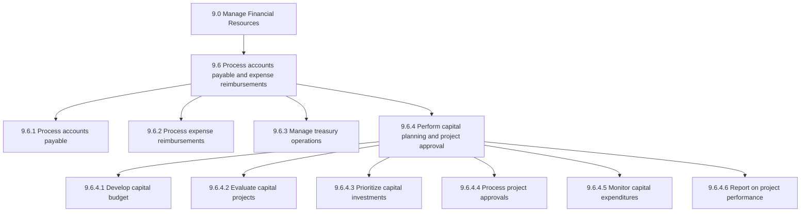
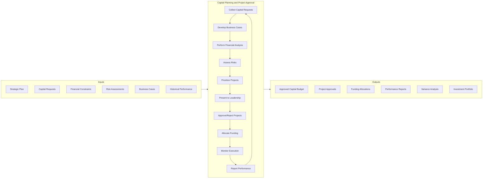
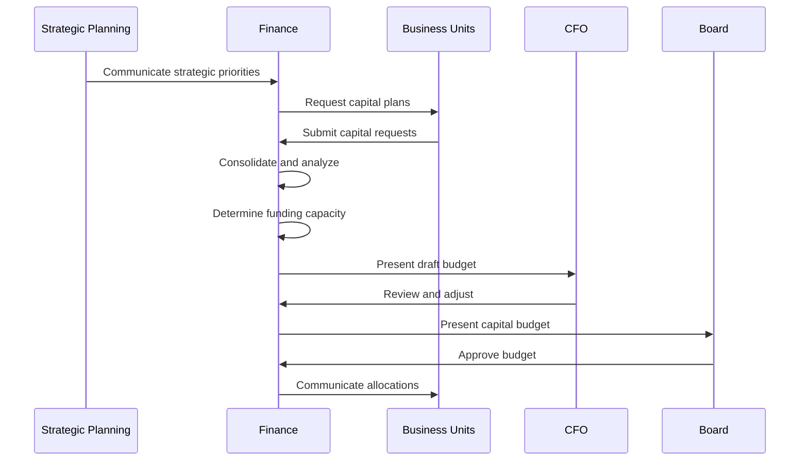
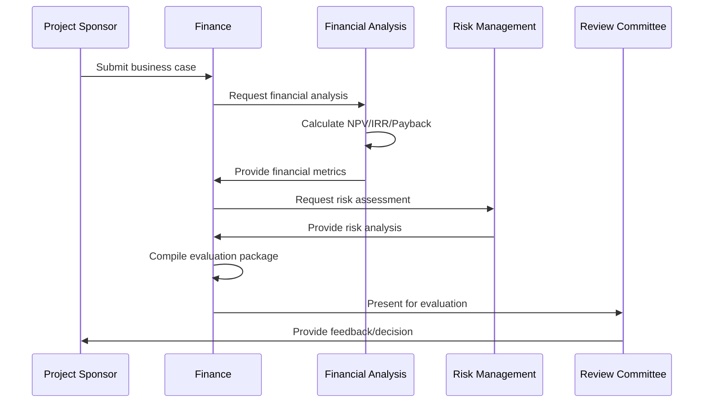
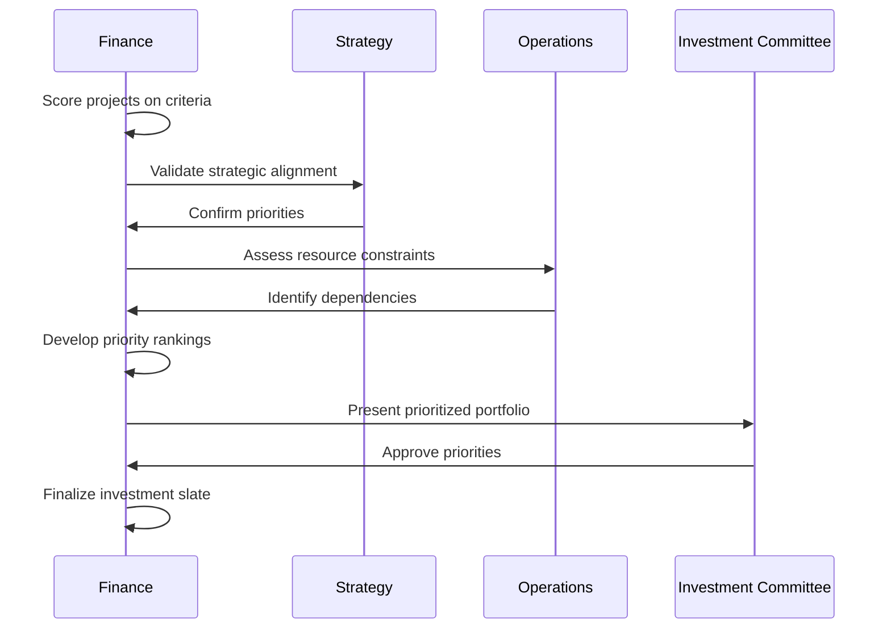
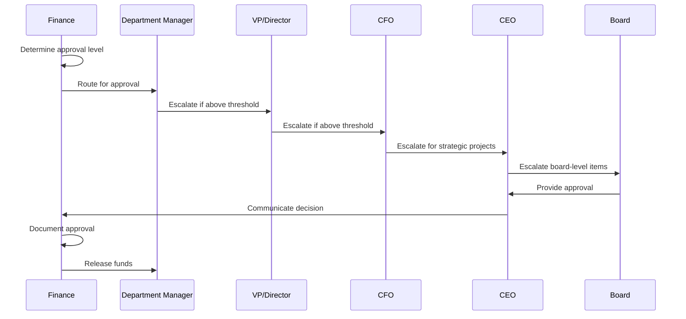
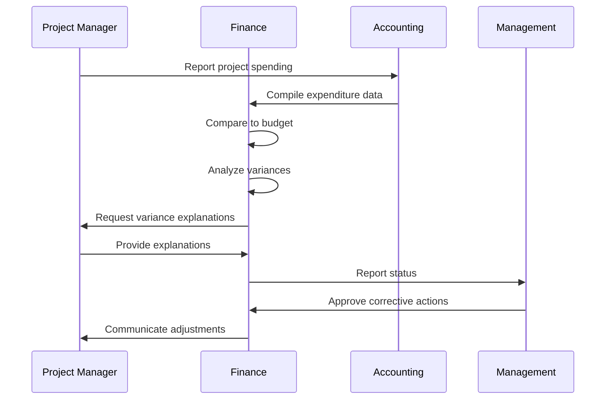
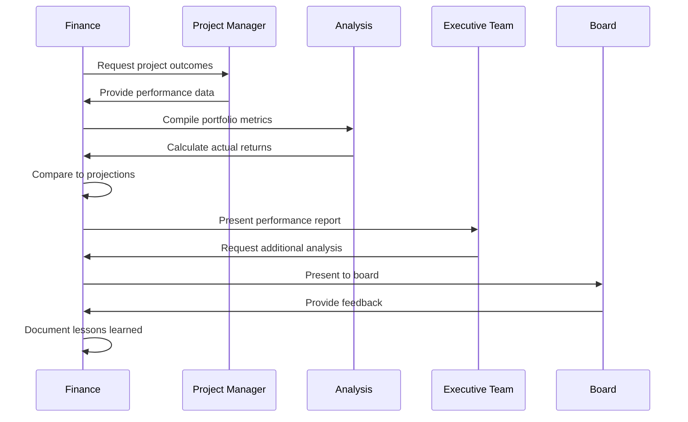
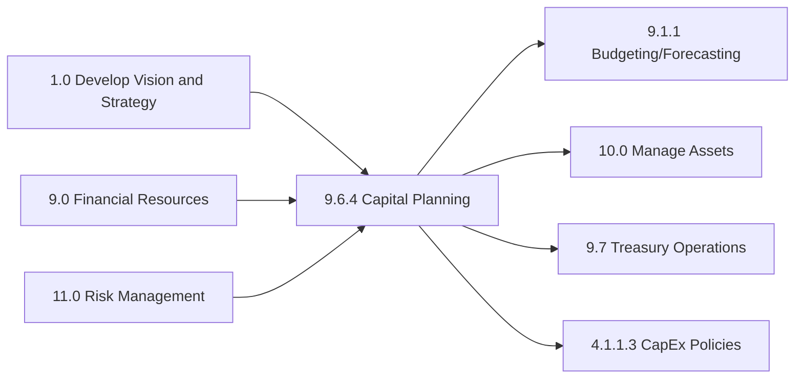

# Perform capital planning and project approval

> Preparing a project finance report to solicit approvals in capital projects. Prepare budgets for projects that require heavy investments. Report on project finances to solicit approvals from management.

## Overview

Perform capital planning and project approval is a critical financial process within the Process accounts payable and expense reimbursements process group (9.6). This process ensures organizations make informed capital investment decisions through rigorous analysis, prioritization, and governance.

Capital planning involves identifying, evaluating, prioritizing, and approving investments in long-term assets that support strategic objectives. The process encompasses business case development, financial analysis (ROI, NPV, IRR), project prioritization, approval workflows, and ongoing investment tracking.

Effective capital planning balances strategic growth investments with maintenance capital requirements while ensuring optimal allocation of limited financial resources across competing priorities.

## Process Hierarchy



## Key Statistics

| Metric | Value |
|--------|-------|
| APQC Code | 10751 |
| Hierarchy ID | 9.6.4 |
| Level | Process |
| Category | [Manage Financial Resources](/processes/09-Finance) |
| Process Group | 9.6 - Process accounts payable and expense reimbursements |
| Activities | 6 |

## Process Flow



## GraphDL Semantic Structure

```
perform.CapitalPlanning.and.ProjectApproval
```

| Component | Value | Description |
|-----------|-------|-------------|
| Verb | `perform` | Primary action of executing the planning process |
| Object | `CapitalPlanning` | Long-term investment planning activities |
| Preposition | `and` | Conjunction connecting related activities |
| PrepObject | `ProjectApproval` | Governance and approval of capital projects |

## Activities

### 9.6.4.1 - Develop capital budget

Creating the annual capital budget that aligns investment capacity with strategic priorities, considering financial constraints and return requirements.



**Tasks:**
- `assess.FundingCapacity` - Determine available capital resources
- `collect.CapitalRequests` - Gather investment proposals from business units
- `consolidate.CapitalBudget` - Combine requests into unified budget
- `align.WithStrategy` - Ensure budget supports strategic objectives

### 9.6.4.2 - Evaluate capital projects

Analyzing individual capital projects through business case review, financial modeling, and risk assessment to determine project viability.



**Tasks:**
- `review.BusinessCase` - Assess project justification and alignment
- `perform.FinancialAnalysis` - Calculate ROI, NPV, IRR, payback period
- `assess.ProjectRisks` - Identify and quantify project risks
- `evaluate.StrategicFit` - Determine alignment with strategic goals

### 9.6.4.3 - Prioritize capital investments

Ranking and prioritizing capital projects based on strategic importance, financial returns, risk levels, and resource constraints.



**Tasks:**
- `define.PriorityCriteria` - Establish evaluation and scoring criteria
- `score.Projects` - Rate projects against criteria
- `analyze.PortfolioBalance` - Assess mix of growth vs maintenance investments
- `optimize.ResourceAllocation` - Allocate constrained resources effectively

### 9.6.4.4 - Process project approvals

Managing the approval workflow for capital projects through appropriate governance bodies based on project size and strategic importance.



**Tasks:**
- `route.ForApproval` - Direct projects to appropriate approval level
- `manage.ApprovalWorkflow` - Track projects through approval process
- `document.Decisions` - Record approval decisions and conditions
- `release.Funding` - Authorize fund disbursement upon approval

### 9.6.4.5 - Monitor capital expenditures

Tracking capital project spending against approved budgets and timelines, identifying variances and escalating issues.



**Tasks:**
- `track.ProjectSpending` - Monitor actual vs budgeted expenditures
- `analyze.Variances` - Investigate spending deviations
- `forecast.Completion` - Project final costs at completion
- `escalate.Issues` - Report significant variances to management

### 9.6.4.6 - Report on project performance

Evaluating capital project outcomes against original business case projections and reporting on investment portfolio performance.



**Tasks:**
- `measure.ProjectOutcomes` - Assess actual project results
- `compare.ToProjections` - Evaluate actual vs forecasted returns
- `report.PortfolioPerformance` - Summarize capital investment performance
- `document.LessonsLearned` - Capture insights for future planning

## RACI Matrix

| Activity | Responsible | Accountable | Consulted | Informed |
|----------|-------------|-------------|-----------|----------|
| Develop capital budget | FP&A | CFO | Business units | Executive team |
| Evaluate capital projects | Finance | CFO | Project sponsors | Investment committee |
| Prioritize investments | Finance | CFO | Strategy, Operations | Business units |
| Process approvals | Finance | CFO | Legal, Compliance | Project sponsors |
| Monitor expenditures | Finance | Controller | Project managers | CFO |
| Report performance | Finance | CFO | Business units | Board |
| Present to board | CFO | CEO | Finance | Board members |
| Release funding | Treasury | CFO | Finance | Project sponsors |

## Related Departments

- [Finance](/departments/Finance) - Primary ownership of capital planning process
- [Treasury](/departments/Treasury) - Funding and cash management
- [Strategic Planning](/departments/Strategy) - Strategic alignment
- [Operations](/departments/Operations) - Operational capital needs
- [Information Technology](/departments/IT) - Technology investments

## Related Occupations

- [Financial Managers](/occupations/FinancialManagers) - Capital planning leadership
- [Financial Analysts](/occupations/FinancialAnalysts) - Project financial analysis
- [Budget Analysts](/occupations/BudgetAnalysts) - Budget development and tracking
- [Chief Financial Officers](/occupations/CFO) - Approval authority and governance
- [Management Analysts](/occupations/ManagementAnalysts) - Business case development

## Industry Variations

### Aerospace and Defense

Aerospace capital planning spans multi-decade programs with progress billing and government contract requirements. Investment decisions must align with defense budget cycles and program milestones.

**Industry-Specific Activities:**
- Plan capital investments over 10-20 year program cycles
- Align with government fiscal year budget processes
- Manage progress billing for large capital projects
- Track allowable vs unallowable capital costs

### Banking

Banking capital planning must consider regulatory capital requirements (Basel III/IV) and stress testing implications. Technology investments for digital transformation are significant.

**Industry-Specific Activities:**
- Assess regulatory capital impact of investments
- Integrate with CCAR/DFAST stress testing
- Evaluate digital transformation investments
- Consider branch optimization capital needs

### Healthcare Provider

Healthcare capital planning addresses medical equipment, facility expansion, and technology investments. Certificate of Need requirements and reimbursement implications are critical considerations.

**Industry-Specific Activities:**
- Navigate Certificate of Need approval processes
- Assess reimbursement implications of investments
- Plan medical equipment replacement cycles
- Evaluate facility expansion investments

### Retail

Retail capital planning focuses on store development, renovation, and technology investments. Rapid expansion and omnichannel investments require agile approval processes.

**Industry-Specific Activities:**
- Plan new store development capital
- Evaluate store renovation investments
- Assess omnichannel technology investments
- Consider lease vs buy decisions

### Utilities

Utilities capital planning involves long-lived infrastructure with regulatory rate recovery considerations. Prudency reviews and rate case implications drive planning rigor.

**Industry-Specific Activities:**
- Plan for regulatory rate recovery of capital
- Document prudency for commission review
- Align capital plans with rate cases
- Manage renewable energy transition investments

### Manufacturing

Manufacturing capital planning emphasizes production capacity, automation, and efficiency investments. Capacity planning and technology obsolescence drive planning cycles.

**Industry-Specific Activities:**
- Plan production capacity expansions
- Evaluate automation and robotics investments
- Assess equipment replacement cycles
- Consider lean manufacturing investments

## Sub-Processes

| Process | Code | Description |
|---------|------|-------------|
| Develop capital budget | 9.6.4.1 | Create annual capital investment budget |
| Evaluate capital projects | 9.6.4.2 | Analyze project viability and returns |
| Prioritize capital investments | 9.6.4.3 | Rank and select projects for funding |
| Process project approvals | 9.6.4.4 | Manage approval workflows |
| Monitor capital expenditures | 9.6.4.5 | Track spending vs budget |
| Report on project performance | 9.6.4.6 | Evaluate investment outcomes |

## Related Processes



## Metrics & KPIs

| Metric | Description | Target |
|--------|-------------|--------|
| Capital Budget Accuracy | Actual vs planned capital spend | +/- 5% |
| Project Approval Cycle Time | Days to approve capital projects | <30 days |
| NPV Realization | Actual NPV vs projected NPV | >90% |
| IRR Achievement | Projects meeting target IRR | >85% |
| On-Time Project Completion | Projects completed on schedule | >80% |
| On-Budget Completion | Projects completed within budget | >85% |
| Portfolio ROI | Overall capital portfolio return | >15% |
| Strategic Alignment Score | Capital aligned with strategy | >90% |
| Maintenance vs Growth Ratio | Balance of capital types | Per policy |
| Post-Implementation Review | Projects reviewed after completion | 100% |

---

*Source: APQC PCF 10751 (9.6.4) - Cross-Industry*
