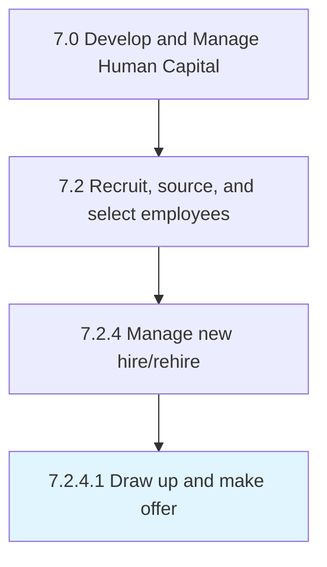

# Draw up and make offer

> Compiling job-related information for the selected candidates in order to make up a job.

## Overview

Activity 7.2.4.1 is an activity within the Develop and Manage Human Capital framework. 

Compiling job-related information for the selected candidates in order to make up a job. Include information about the job description, reporting relationship, salary, bonus potential, benefits, and vacation allotment.

## Process Hierarchy



## Key Statistics

| Metric | Value |
|--------|-------|
| APQC Code | 10463 |
| Hierarchy ID | 7.2.4.1 |
| Level | Activity |
| Parent | [7.2.4](../) |
| Sub-Processes | 0 |


## GraphDL Semantic Structure

```
draw.UpAndMakeOffer
```

| Component | Value | Description |
|-----------|-------|-------------|
| Verb | `draw` | Primary action |
| Object | `up and make offer` | Direct object |


## Related Concepts

- [MakeOffer](/concepts/MakeOffer)


---

*Source: APQC PCF 10463 (7.2.4.1) - APQC*
