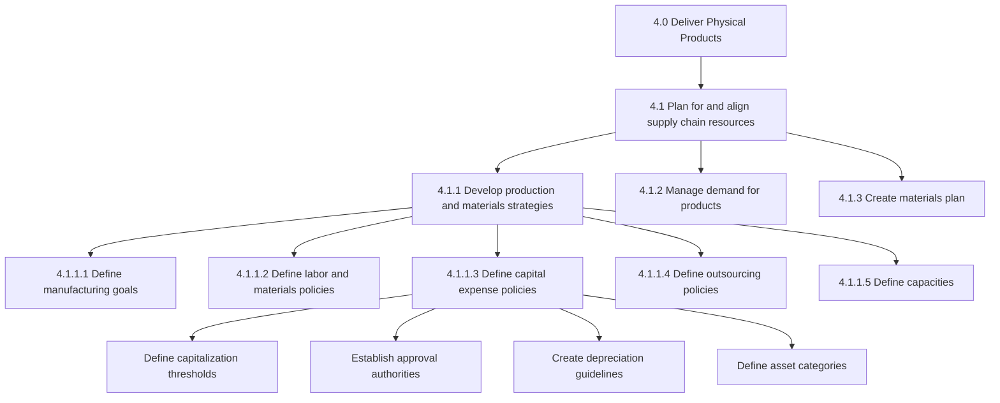
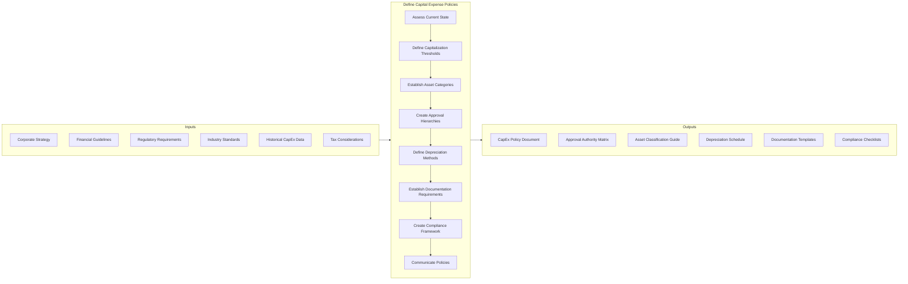
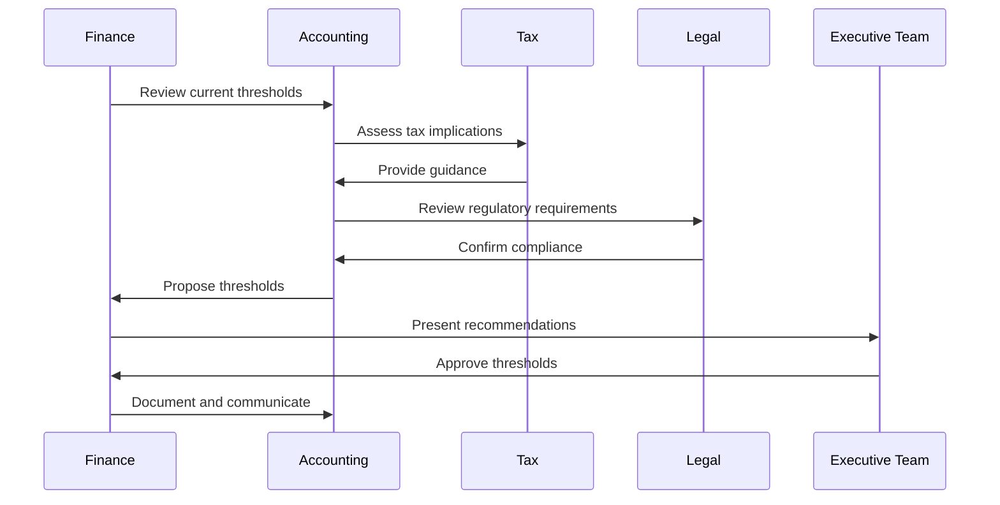
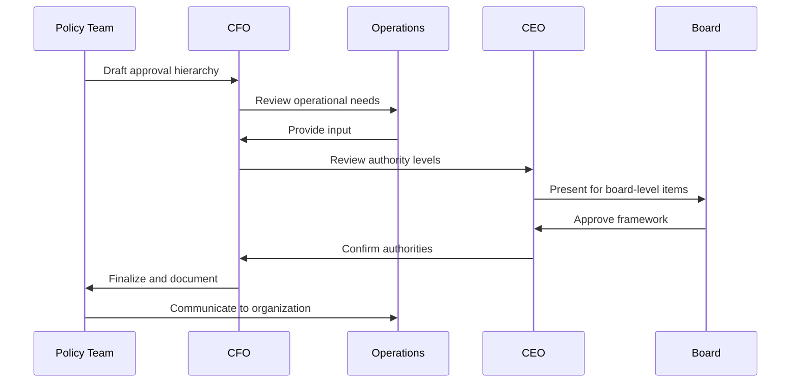
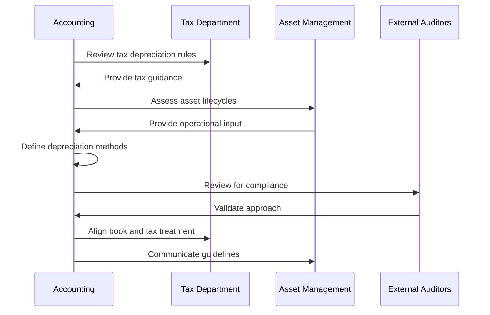
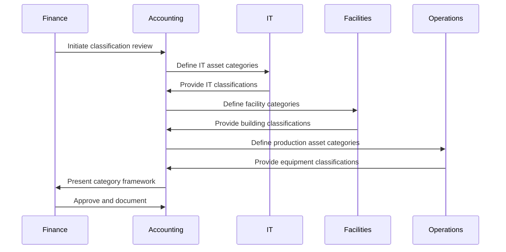
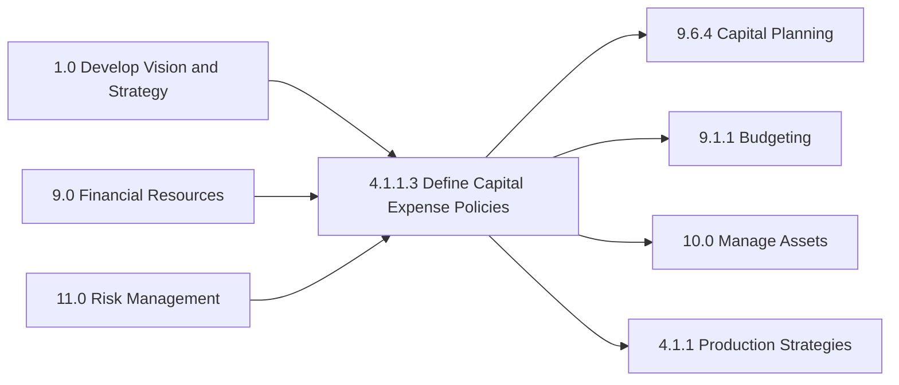

# Define capital expense policies

> Designing rules and regulations pertaining to the expenditure incurred in acquiring or upgrading the existing stock of manufacturing capital.

## Overview

Define capital expense policies is a process within the Develop production and materials strategies process group (4.1.1). This process establishes the governance framework for capital expenditures used to acquire, upgrade, or expand manufacturing assets and infrastructure.

Capital expense (CapEx) policies provide the rules, thresholds, approval workflows, and accounting treatments for investments in long-term assets. These policies ensure consistent decision-making, proper financial controls, regulatory compliance, and alignment between capital investments and strategic objectives.

Effective capital expense policies balance the need for operational flexibility with appropriate financial controls, enabling organizations to make timely investments while maintaining accountability and fiscal discipline.

## Process Hierarchy



## Key Statistics

| Metric | Value |
|--------|-------|
| APQC Code | 10232 |
| Hierarchy ID | 4.1.1.3 |
| Level | Activity |
| Category | [Deliver Physical Products](/processes/04-Delivery) |
| Process Group | 4.1 - Plan for and align supply chain resources |
| Parent Process | 4.1.1 - Develop production and materials strategies |

## Process Flow



## GraphDL Semantic Structure

```
define.CapitalExpensePolicies
```

| Component | Value | Description |
|-----------|-------|-------------|
| Verb | `define` | Primary action of establishing and documenting |
| Object | `CapitalExpensePolicies` | Rules governing capital expenditure decisions |
| Preposition | - | Not applicable |
| PrepObject | - | Not applicable |

## Activities

### 4.1.1.3.1 - Define capitalization thresholds

Establishing monetary thresholds that determine when expenditures are capitalized as assets versus expensed immediately, ensuring consistent accounting treatment.



**Tasks:**
- `analyze.HistoricalExpenditures` - Review past CapEx patterns and trends
- `define.MonetaryThresholds` - Set minimum amounts for capitalization
- `establish.UsefulLifeCriteria` - Define minimum useful life requirements
- `document.AccountingTreatment` - Specify GAAP/IFRS treatment methods

### 4.1.1.3.2 - Establish approval authorities

Creating the hierarchy of approval levels and authorities for capital expenditure requests based on investment size and strategic importance.



**Tasks:**
- `define.ApprovalLevels` - Establish spending authority tiers
- `create.AuthorityMatrix` - Map roles to approval limits
- `design.EscalationProcess` - Define exception handling procedures
- `establish.BoardApprovals` - Set thresholds requiring board approval

### 4.1.1.3.3 - Create depreciation guidelines

Defining depreciation methods, useful lives, and salvage value assumptions for different asset categories.



**Tasks:**
- `define.DepreciationMethods` - Specify straight-line, declining balance, etc.
- `establish.UsefulLives` - Set standard lives by asset category
- `determine.SalvageValues` - Define residual value assumptions
- `align.BookAndTaxTreatment` - Reconcile financial and tax depreciation

### 4.1.1.3.4 - Define asset categories

Creating a classification system for capital assets that enables consistent treatment, tracking, and reporting.



**Tasks:**
- `create.AssetClassification` - Define major asset categories
- `establish.SubCategories` - Create detailed classification hierarchy
- `define.CategoryAttributes` - Specify characteristics for each category
- `align.WithAccountingStandards` - Ensure compliance with GAAP/IFRS

## RACI Matrix

| Activity | Responsible | Accountable | Consulted | Informed |
|----------|-------------|-------------|-----------|----------|
| Define capitalization thresholds | Controller | CFO | Tax, Audit | Operations |
| Establish approval authorities | Finance | CFO | Legal, Operations | All managers |
| Create depreciation guidelines | Accounting | Controller | Tax, Auditors | Asset managers |
| Define asset categories | Accounting | Controller | IT, Facilities, Ops | Finance staff |
| Document policies | Finance | CFO | Legal | All employees |
| Communicate policies | Finance | CFO | HR, Communications | Organization |
| Monitor compliance | Internal Audit | CFO | Finance | Executive team |
| Update policies | Finance | CFO | All stakeholders | Organization |

## Related Departments

- [Finance](/departments/Finance) - Primary ownership of capital expense policies
- [Accounting](/departments/Accounting) - Policy implementation and compliance
- [Operations](/departments/Operations) - Capital investment execution
- [Facilities](/departments/Facilities) - Building and infrastructure investments
- [Information Technology](/departments/IT) - Technology capital investments

## Related Occupations

- [Financial Managers](/occupations/FinancialManagers) - Policy development and oversight
- [Accountants and Auditors](/occupations/Accountants) - Policy implementation
- [Budget Analysts](/occupations/BudgetAnalysts) - Capital budget management
- [Chief Financial Officers](/occupations/CFO) - Policy approval and governance
- [Internal Auditors](/occupations/InternalAuditors) - Policy compliance monitoring

## Industry Variations

### Aerospace and Defense

Aerospace capital policies must address long-lived, high-value assets and government contract cost allocation requirements. Progress billing and FAR compliance add complexity.

**Industry-Specific Activities:**
- Define government allowable vs. unallowable capital costs
- Establish pooling methods for indirect capital costs
- Create progress billing policies for capital projects
- Align with FAR/DFAR requirements

### Banking

Banking capital expense policies focus on IT infrastructure and branch facilities. Regulatory capital requirements influence investment decisions.

**Industry-Specific Activities:**
- Define IT infrastructure capitalization policies
- Establish branch renovation thresholds
- Create regulatory capital impact assessments
- Align with OCC/Fed guidance on premises

### Healthcare Provider

Healthcare capital policies address medical equipment, facilities, and technology investments. Certificate of Need requirements and reimbursement considerations are critical.

**Industry-Specific Activities:**
- Define medical equipment capitalization rules
- Establish Certificate of Need thresholds
- Create reimbursement impact analysis requirements
- Align with CMS capital cost reporting

### Manufacturing

Manufacturing capital policies emphasize production equipment, automation investments, and facility expansions. Capacity planning alignment is essential.

**Industry-Specific Activities:**
- Define production equipment categories
- Establish automation investment thresholds
- Create capacity expansion approval processes
- Align with lean manufacturing principles

### Retail

Retail capital policies address store buildouts, fixtures, and technology investments. Rapid store expansion requires streamlined approval processes.

**Industry-Specific Activities:**
- Define store buildout capitalization rules
- Establish fixture and equipment thresholds
- Create rapid approval processes for expansions
- Align with lease accounting requirements

### Utilities

Utilities capital policies govern long-lived infrastructure investments subject to rate recovery. Regulatory approval and prudency review requirements are critical.

**Industry-Specific Activities:**
- Define rate base eligible investments
- Establish regulatory approval thresholds
- Create prudency documentation requirements
- Align with utility commission guidelines

## Sub-Processes

| Process | Code | Description |
|---------|------|-------------|
| Define capitalization thresholds | 4.1.1.3.1 | Set monetary limits for asset capitalization |
| Establish approval authorities | 4.1.1.3.2 | Create spending approval hierarchies |
| Create depreciation guidelines | 4.1.1.3.3 | Define asset depreciation methods |
| Define asset categories | 4.1.1.3.4 | Classify capital asset types |
| Document and communicate policies | 4.1.1.3.5 | Publish and distribute policies |
| Monitor policy compliance | 4.1.1.3.6 | Audit adherence to policies |

## Related Processes



## Metrics & KPIs

| Metric | Description | Target |
|--------|-------------|--------|
| Policy Compliance Rate | CapEx following policy guidelines | >98% |
| Approval Cycle Time | Days to approve capital requests | <10 days |
| Budget Variance | Actual vs budgeted capital spend | +/- 5% |
| Capitalization Accuracy | Correct asset capitalization rate | >99% |
| Depreciation Accuracy | Correct depreciation calculations | 100% |
| Policy Update Frequency | Annual policy review completion | 100% |
| Audit Findings | Material CapEx policy exceptions | 0 |
| ROI Achievement | Capital projects meeting ROI targets | >85% |

---

*Source: APQC PCF 10232 (4.1.1.3) - Cross-Industry*
