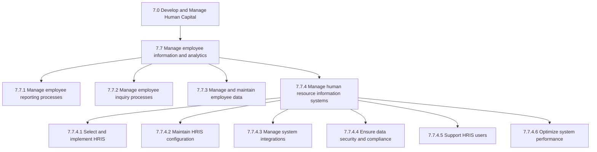
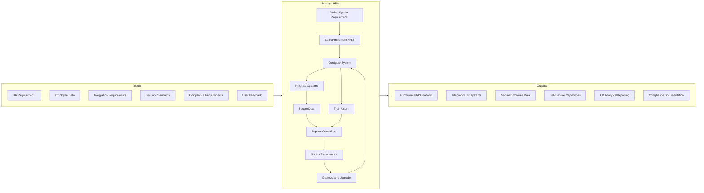
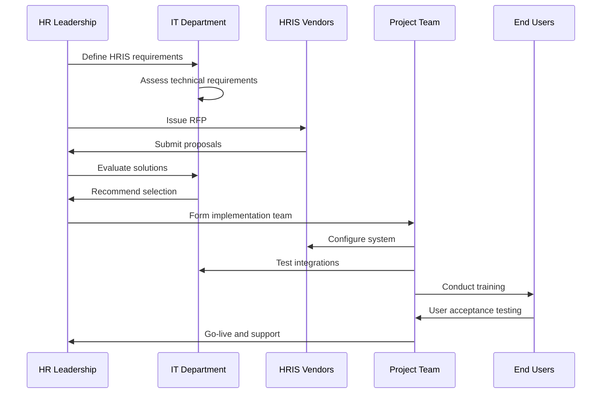
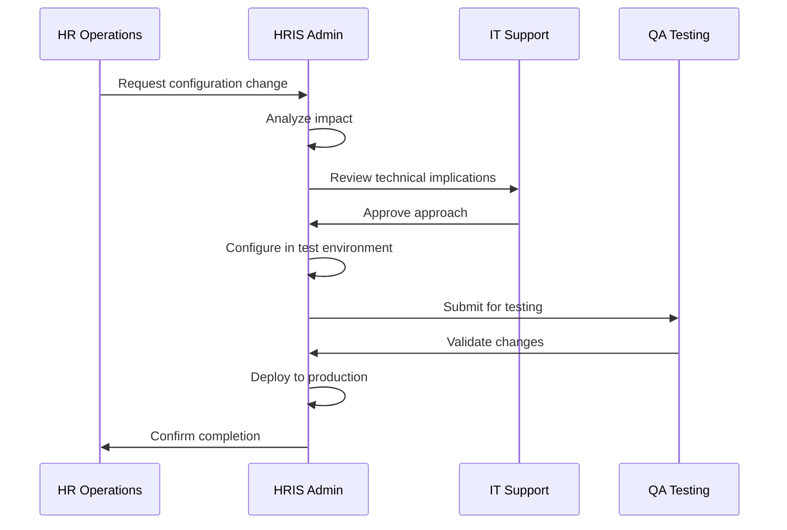
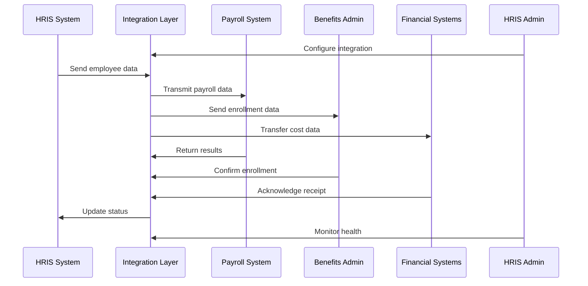
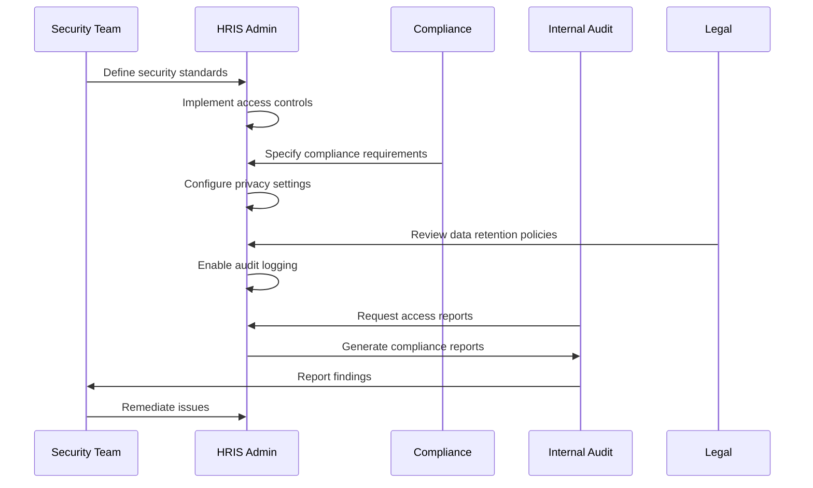
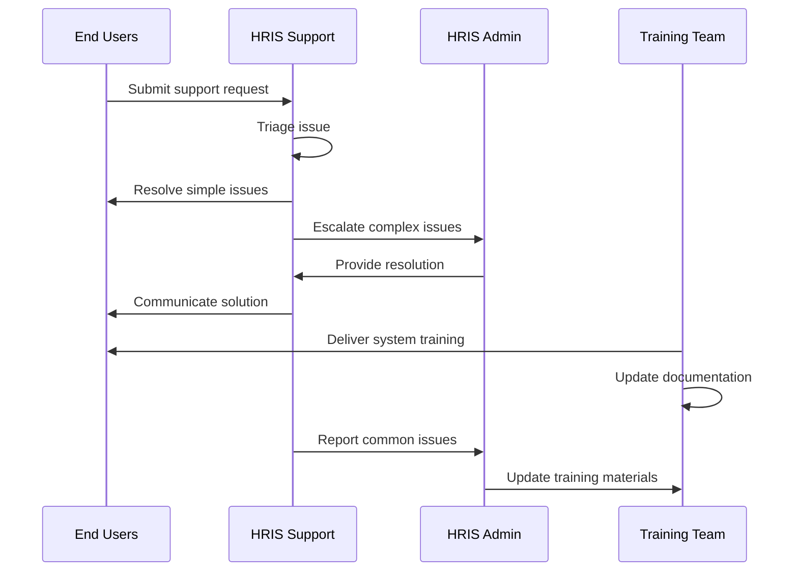
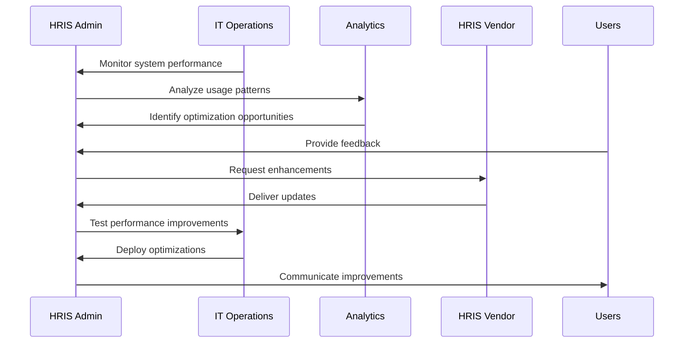
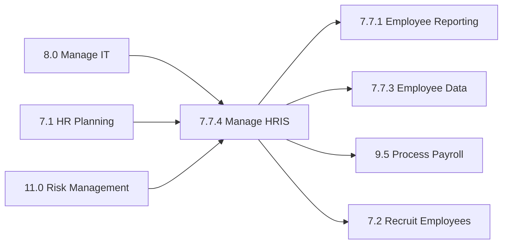

# Manage human resource information systems HRIS

> Administering and maintaining HR information systems that take care of activities related to HR, accounting, management, and payroll.

## Overview

Manage human resource information systems (HRIS) is a critical process within the Manage employee information and analytics process group (7.7). This process ensures organizations have robust technology platforms to support all HR functions, from recruitment to retirement.

HRIS management encompasses system selection, implementation, maintenance, integration, security, and optimization. Modern HRIS platforms serve as the central repository for employee data and the operational backbone for HR service delivery, self-service capabilities, and workforce analytics.

Effective HRIS management enables HR to transition from administrative tasks to strategic initiatives by automating routine processes, providing real-time workforce insights, and delivering seamless employee experiences across the employment lifecycle.

## Process Hierarchy



## Key Statistics

| Metric | Value |
|--------|-------|
| APQC Code | 10525 |
| Hierarchy ID | 7.7.4 |
| Level | Activity |
| Category | [Develop and Manage Human Capital](/processes/07-HR) |
| Process Group | 7.7 - Manage employee information and analytics |
| Parent Process | 7.7.4 - Manage HR information systems |

## Process Flow



## GraphDL Semantic Structure

```
manage.HumanResourceInformationSystems.HRIS
```

| Component | Value | Description |
|-----------|-------|-------------|
| Verb | `manage` | Primary action of administering and maintaining |
| Object | `HumanResourceInformationSystems` | Technology platforms for HR data and processes |
| Preposition | - | Not applicable |
| PrepObject | `HRIS` | Abbreviation clarifying the system type |

## Activities

### 7.7.4.1 - Select and implement HRIS

Evaluating, selecting, and implementing HR information systems based on organizational requirements, scalability needs, and integration capabilities.



**Tasks:**
- `define.SystemRequirements` - Document functional and technical HRIS requirements
- `evaluate.VendorSolutions` - Assess HRIS vendors against requirements
- `implement.HRISSolution` - Execute system implementation project
- `migrate.EmployeeData` - Transfer data from legacy systems

### 7.7.4.2 - Maintain HRIS configuration

Configuring and maintaining HRIS settings, workflows, business rules, and system parameters to support HR processes.



**Tasks:**
- `configure.SystemSettings` - Set up HRIS parameters and business rules
- `maintain.WorkflowConfigurations` - Manage approval workflows and processes
- `update.OrganizationalStructure` - Reflect org changes in system hierarchy
- `manage.SecurityRoles` - Configure user access and permissions

### 7.7.4.3 - Manage system integrations

Establishing and maintaining integrations between HRIS and other enterprise systems including payroll, benefits, time tracking, and ERP systems.



**Tasks:**
- `design.IntegrationArchitecture` - Plan system connectivity approach
- `build.SystemInterfaces` - Develop integration points between systems
- `monitor.DataFlows` - Track data synchronization across systems
- `troubleshoot.IntegrationIssues` - Resolve data exchange problems

### 7.7.4.4 - Ensure data security and compliance

Implementing security controls, access management, and compliance measures to protect employee data and meet regulatory requirements.



**Tasks:**
- `implement.AccessControls` - Configure role-based security
- `protect.SensitiveData` - Encrypt and mask confidential information
- `maintain.AuditTrails` - Track all system access and changes
- `ensure.RegulatoryCompliance` - Meet GDPR, CCPA, and other requirements

### 7.7.4.5 - Support HRIS users

Providing training, documentation, and ongoing support for HRIS users including HR staff, managers, and employees.



**Tasks:**
- `deliver.UserTraining` - Train employees on HRIS functionality
- `create.Documentation` - Develop user guides and job aids
- `provide.HelpDeskSupport` - Respond to user questions and issues
- `manage.ChangeRequests` - Process enhancement requests

### 7.7.4.6 - Optimize system performance

Monitoring, analyzing, and improving HRIS performance, usability, and effectiveness.



**Tasks:**
- `monitor.SystemPerformance` - Track system speed and availability
- `analyze.UsagePatterns` - Review how employees use the system
- `implement.Improvements` - Deploy performance enhancements
- `plan.SystemUpgrades` - Schedule version updates and patches

## RACI Matrix

| Activity | Responsible | Accountable | Consulted | Informed |
|----------|-------------|-------------|-----------|----------|
| Select HRIS | HR Technology | CHRO | IT, Finance | Executive team |
| Implement HRIS | Project Team | HR Technology | IT, Vendors | All HR staff |
| Configure system | HRIS Admin | HR Technology | HR Operations | IT |
| Manage integrations | HRIS Admin | HR Technology | IT | Payroll, Benefits |
| Ensure security | HRIS Admin | CISO | Legal, Compliance | HR Leadership |
| Train users | Training Team | HR Technology | HRIS Admin | All employees |
| Support users | Help Desk | HR Technology | HRIS Admin | Users |
| Optimize performance | HRIS Admin | HR Technology | IT | HR Leadership |

## Related Departments

- [Human Resources](/departments/HR) - Primary owner and user of HRIS
- [Information Technology](/departments/IT) - Technical support and infrastructure
- [Finance](/departments/Finance) - Payroll integration and cost management
- [Legal](/departments/Legal) - Data privacy and compliance
- [Security](/departments/Security) - Information security oversight

## Related Occupations

- [Human Resources Information System Specialists](/occupations/HRISSpecialists) - Primary HRIS administration
- [Computer Systems Analysts](/occupations/SystemsAnalysts) - System analysis and design
- [Database Administrators](/occupations/DatabaseAdmins) - Data management support
- [Information Security Analysts](/occupations/SecurityAnalysts) - Security implementation
- [Training and Development Specialists](/occupations/TrainingSpecialists) - User training

## Industry Variations

### Aerospace and Defense

HRIS in aerospace must support security clearance tracking, ITAR compliance documentation, and integration with government contractor systems. Enhanced audit trails and access controls are critical.

**Industry-Specific Activities:**
- Manage security clearance tracking modules
- Integrate with government reporting systems
- Maintain ITAR compliance documentation
- Support multi-site, multi-security-level access

### Banking

Banking HRIS emphasizes regulatory reporting, compensation governance tracking, and integration with trading floor systems. Strict audit requirements and real-time reporting capabilities are essential.

**Industry-Specific Activities:**
- Support regulatory compensation reporting
- Integrate with trading system identity management
- Maintain enhanced audit trails for regulators
- Enable mandatory training tracking

### Healthcare Provider

Healthcare HRIS supports complex credentialing, licensure tracking, and integration with scheduling systems. Patient privacy training tracking and union contract management are often required.

**Industry-Specific Activities:**
- Manage clinical credentialing workflows
- Track licensure expirations and renewals
- Integrate with nurse scheduling systems
- Support HIPAA training compliance

### Retail

Retail HRIS handles high-volume hiring, seasonal workforce fluctuations, and integration with point-of-sale scheduling. Mobile self-service for distributed workforce is critical.

**Industry-Specific Activities:**
- Support high-volume seasonal hiring
- Integrate with labor scheduling systems
- Enable mobile self-service for store employees
- Manage multi-location workforce data

### Utilities

Utilities HRIS supports union workforce management, safety certification tracking, and storm response mobilization. Integration with work management systems is essential.

**Industry-Specific Activities:**
- Manage union contract provisions in system
- Track safety certifications and qualifications
- Support emergency response workforce mobilization
- Integrate with work order management systems

## Sub-Processes

| Process | Code | Description |
|---------|------|-------------|
| Select and implement HRIS | 7.7.4.1 | Evaluate and deploy HRIS solutions |
| Maintain HRIS configuration | 7.7.4.2 | Manage system settings and workflows |
| Manage system integrations | 7.7.4.3 | Connect HRIS with other systems |
| Ensure data security | 7.7.4.4 | Protect employee data and compliance |
| Support HRIS users | 7.7.4.5 | Train and assist system users |
| Optimize system performance | 7.7.4.6 | Improve HRIS effectiveness |

## Related Processes



## Metrics & KPIs

| Metric | Description | Target |
|--------|-------------|--------|
| System Uptime | HRIS availability percentage | >99.5% |
| User Adoption | Employees actively using self-service | >90% |
| Data Accuracy | Employee records without errors | >99% |
| Integration Success Rate | Successful data exchanges | >99.9% |
| Support Ticket Resolution | Average time to resolve issues | <24 hours |
| Training Completion | Users trained on system | 100% |
| Compliance Audit Score | Regulatory compliance rating | Pass |
| User Satisfaction | HRIS user satisfaction score | >4.0/5.0 |
| Cost per Employee | Annual HRIS cost per employee | <$150 |
| Self-Service Transaction Rate | Transactions via self-service | >80% |

---

*Source: APQC PCF 10525 (7.7.4) - Cross-Industry*
