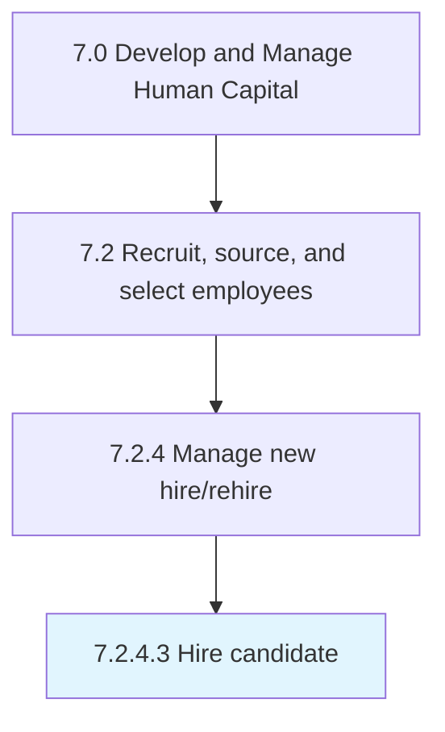

# Hire candidate

> Wrapping up the process for hiring candidates.

## Overview

Activity 7.2.4.3 is an activity within the Develop and Manage Human Capital framework. 

Wrapping up the process for hiring candidates. Agree to all hiring terms and conditions. Have the candidate accept and sign the job offer.

## Process Hierarchy



## Key Statistics

| Metric | Value |
|--------|-------|
| APQC Code | 10465 |
| Hierarchy ID | 7.2.4.3 |
| Level | Activity |
| Parent | [7.2.4](../) |
| Sub-Processes | 0 |


## GraphDL Semantic Structure

```
hire.Candidate
```

| Component | Value | Description |
|-----------|-------|-------------|
| Verb | `hire` | Primary action |
| Object | `candidate` | Direct object |


## Related Concepts

- [Candidate](/concepts/Candidate)


---

*Source: APQC PCF 10465 (7.2.4.3) - APQC*
