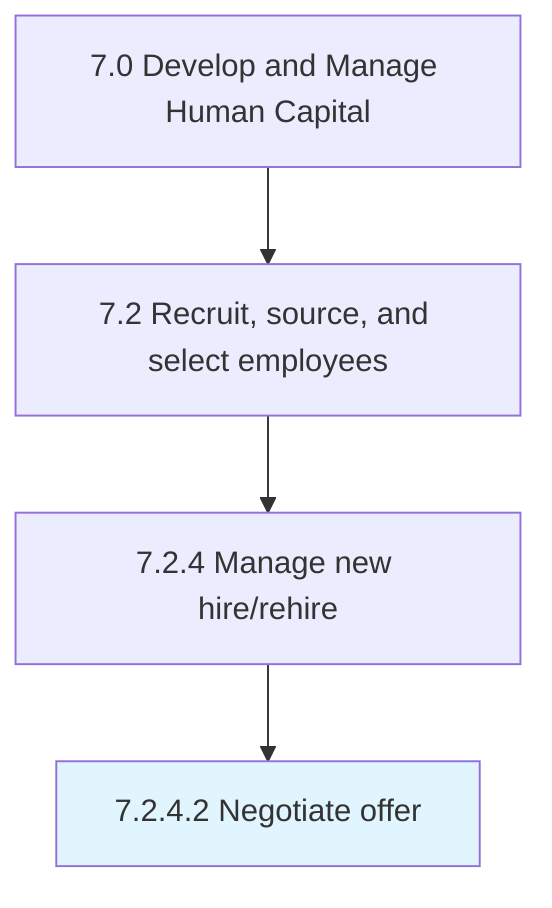

# Negotiate offer

> Negotiating an offer with selected candidates.

## Overview

Activity 7.2.4.2 is an activity within the Develop and Manage Human Capital framework. 

Negotiating an offer with selected candidates. Discuss the job offer with the candidate to ensure a mutual understanding.

## Process Hierarchy



## Key Statistics

| Metric | Value |
|--------|-------|
| APQC Code | 10464 |
| Hierarchy ID | 7.2.4.2 |
| Level | Activity |
| Parent | [7.2.4](../) |
| Sub-Processes | 0 |


## GraphDL Semantic Structure

```
negotiate.Offer
```

| Component | Value | Description |
|-----------|-------|-------------|
| Verb | `negotiate` | Primary action |
| Object | `offer` | Direct object |


## Related Concepts

- [Offer](/concepts/Offer)


---

*Source: APQC PCF 10464 (7.2.4.2) - APQC*
