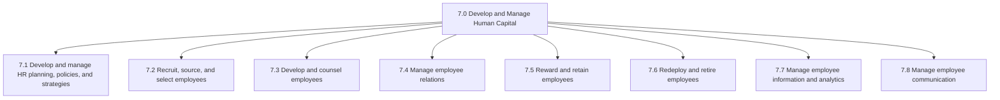
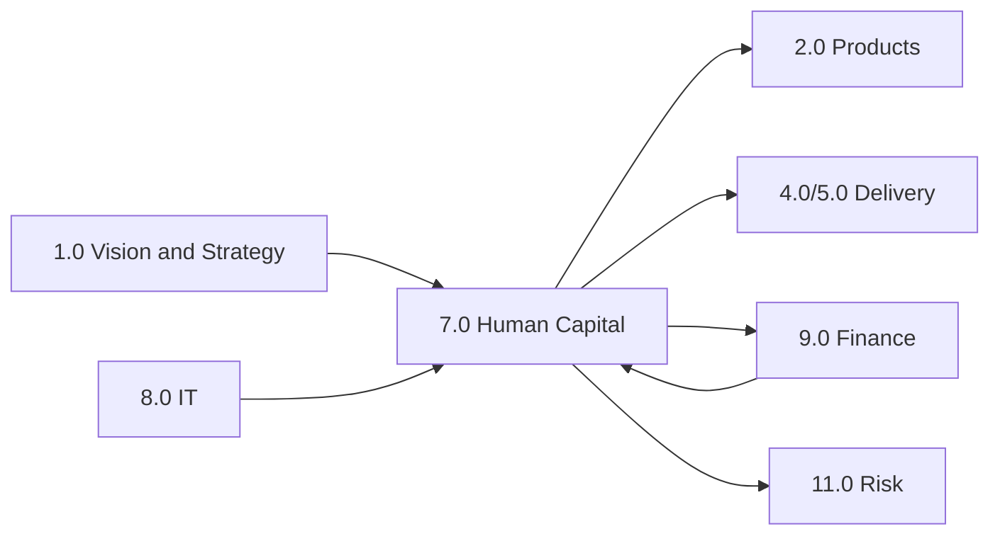

# Human Capital

*APQC Category 7.0 - Develop and Manage Human Capital*

> Delivering processes traditionally defined as "human resources". Process groups include those related to developing and maintaining workforce strategy, recruiting employees, developing and counseling employees, managing employee relations, rewarding and retaining employees, redeploying and retiring employees, managing employee information, and managing employee communications.

## Overview

The Human Capital category (7.0) encompasses all organizational processes related to workforce management. This foundational support category ensures organizations attract, develop, engage, and retain the talent necessary to execute business strategy and deliver value to customers.

Modern human capital management extends beyond traditional personnel administration to serve as a strategic business partner. These processes align workforce capabilities with organizational objectives, create positive employee experiences, build organizational capabilities, and ensure compliance with labor regulations.

## Category Hierarchy

## Process Groups

| Code | Process Group | Description |
|------|---------------|-------------|
| 7.1 | [HR Planning, Policies, and Strategies](./HRPlanning.mdx) | Strategic HR management and workforce planning |
| 7.2 | Recruit, Source, and Select Employees | Talent acquisition and hiring |
| 7.3 | Develop and Counsel Employees | Learning, development, and performance management |
| 7.4 | Manage Employee Relations | Workplace relations and labor management |
| 7.5 | Reward and Retain Employees | Compensation, benefits, and retention |
| 7.6 | Redeploy and Retire Employees | Workforce transitions and separations |
| 7.7 | [Manage Employee Information and Analytics](./HRIS.mdx) | HRIS and workforce analytics |
| 7.8 | Manage Employee Communication | Internal communications |

## Processes in this Category

- [Develop and Manage Human Capital](./HumanCapital.mdx) - Category 7.0 overview
- [Develop and manage human resources planning, policies, and strategies](./HRPlanning.mdx) - Process 7.1
- [Manage human resource information systems HRIS](./HRIS.mdx) - Process 7.7.4
- [Define capital expense policies](./ExpensePolicies.mdx) - Process 4.1.1.3
- [Perform capital planning and project approval](./CapitalPlanning.mdx) - Process 9.6.4

## Key Statistics

| Metric | Value |
|--------|-------|
| APQC Code | 10007 |
| Hierarchy ID | 7.0 |
| Level | Category |
| Process Groups | 8 |
| Total Sub-Processes | 150+ |

## Process Flow

```mermaid
flowchart LR
    subgraph Planning["Strategic Planning"]
        P1["Develop HR Strategy"]
        P2["Plan Workforce"]
    end

    subgraph Acquisition["Talent Acquisition"]
        P3["Recruit"]
        P4["Select"]
        P5["Onboard"]
    end

    subgraph Development["Employee Development"]
        P6["Train"]
        P7["Develop"]
        P8["Manage Performance"]
    end

    subgraph Retention["Retention & Relations"]
        P9["Reward"]
        P10["Manage Relations"]
        P11["Communicate"]
    end

    subgraph Transition["Workforce Transition"]
        P12["Redeploy"]
        P13["Retire/Separate"]
    end

    Planning --> Acquisition
    Acquisition --> Development
    Development --> Retention
    Retention --> Transition
    Transition --> Planning
```

## Related Categories

## Industry Variations

### Aerospace and Defense
Focus on security clearances, ITAR compliance, and multi-decade succession planning for specialized engineering talent.

### Banking
Emphasis on regulatory compliance training, risk culture development, and compensation governance within regulatory limits.

### Healthcare Provider
Complex credentialing requirements, shift scheduling, burnout prevention, and union relations in many settings.

### Retail
High-volume seasonal hiring, part-time workforce management, labor scheduling optimization, and frontline turnover reduction.

### Education
Tenure systems, academic freedom considerations, faculty governance, and student-facing workforce requirements.

## Metrics & KPIs

| Metric | Description | Target |
|--------|-------------|--------|
| Time to Fill | Average days to fill positions | <45 days |
| Employee Turnover | Annual voluntary turnover rate | <15% |
| Employee Engagement | Annual engagement survey score | >75% |
| Training Hours | Average training hours per employee | >40 hours/year |
| HR Cost per Employee | Total HR cost / headcount | <$2,500 |
| Quality of Hire | New hire performance at 1 year | >85% meet expectations |
| Internal Fill Rate | Positions filled internally | >25% |
| Diversity Index | Workforce diversity metrics | Industry benchmark |

---

*Source: APQC PCF 10007 (7.0) - Cross-Industry*
