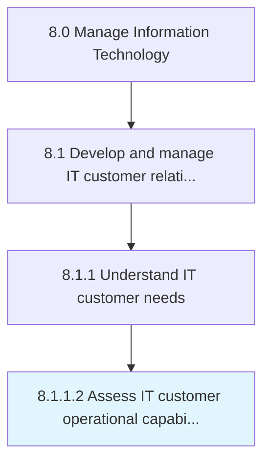

# Assess IT customer operational capabilities

> Evaluate the ability of the group of staff dependent on information technology, to align resources and critical processes according to organizational vision being able to deliver effectively and efficiently.

## Overview

Activity 8.1.1.2 is an activity within the Manage Information Technology framework. 

Evaluate the ability of the group of staff dependent on information technology, to align resources and critical processes according to organizational vision being able to deliver effectively and efficiently.

## Process Hierarchy



## Key Statistics

| Metric | Value |
|--------|-------|
| APQC Code | 20611 |
| Hierarchy ID | 8.1.1.2 |
| Level | Activity |
| Parent | [8.1.1](../) |
| Sub-Processes | 0 |


## GraphDL Semantic Structure

```
assess.ITCustomerOperationalCapabilities
```

| Component | Value | Description |
|-----------|-------|-------------|
| Verb | `assess` | Primary action |
| Object | `IT customer operational capabilities` | Direct object |


## Related Concepts

- [ITCustomerOperationalCapabilities](/concepts/ITCustomerOperationalCapabilities)


---

*Source: APQC PCF 20611 (8.1.1.2) - APQC*
