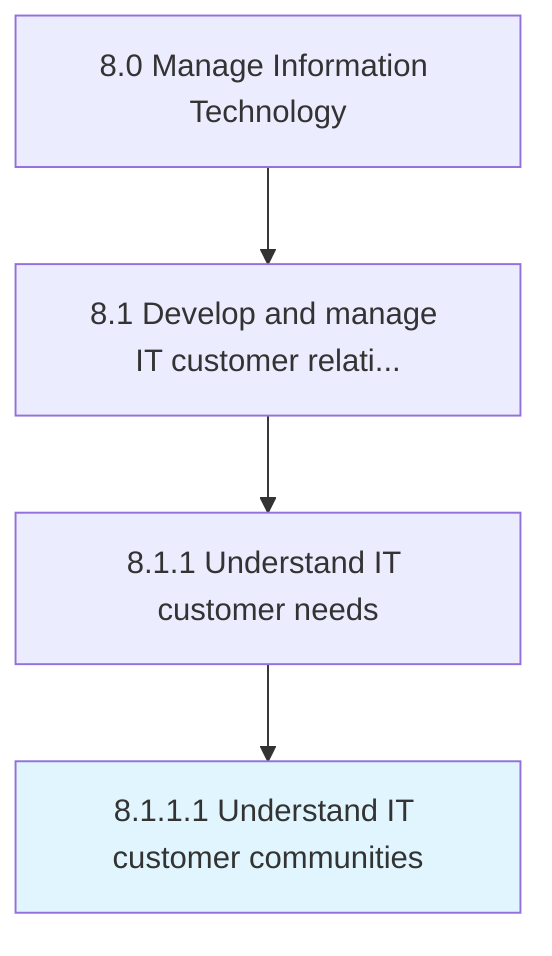

# Understand IT customer communities

> Interacting with IT customers to understand the IT needs through a collaborative community through involvement, connection, and informed communication.

## Overview

Activity 8.1.1.1 is an activity within the Manage Information Technology framework. 

Interacting with IT customers to understand the IT needs through a collaborative community through involvement, connection, and informed communication.

## Process Hierarchy



## Key Statistics

| Metric | Value |
|--------|-------|
| APQC Code | 20610 |
| Hierarchy ID | 8.1.1.1 |
| Level | Activity |
| Parent | [8.1.1](../) |
| Sub-Processes | 0 |


## GraphDL Semantic Structure

```
understand.ITCustomerCommunities
```

| Component | Value | Description |
|-----------|-------|-------------|
| Verb | `understand` | Primary action |
| Object | `IT customer communities` | Direct object |


## Related Concepts

- ITCustomerCommunities


---

*Source: APQC PCF 20610 (8.1.1.1) - APQC*
