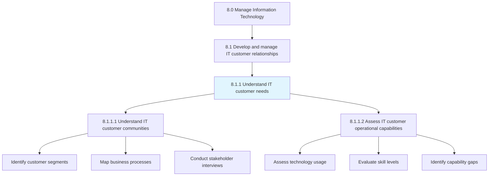
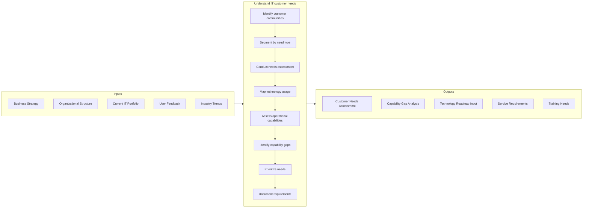
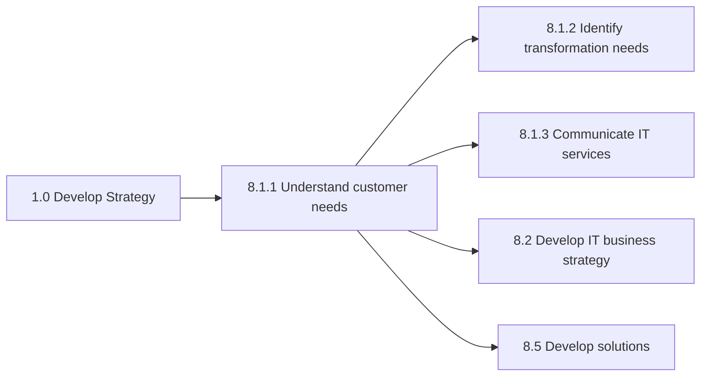

# Understand IT customer needs

> Assessing the customer communities along with current IT operational capabilities and usage.

## Overview

Process 8.1.1 is a core process that defines the specific procedures for understanding IT customer needs. This foundational process ensures that IT services and solutions are aligned with actual business requirements and user expectations.

Assessing the customer communities along with current IT operational capabilities and usage. This process involves systematic engagement with business stakeholders to identify, document, and prioritize technology needs. It forms the foundation for IT strategy, service design, and investment decisions.

Understanding IT customer needs goes beyond capturing feature requests. It requires deep comprehension of business processes, pain points, strategic objectives, and the technology landscape. This holistic understanding enables IT to serve as a true business partner rather than just a service provider.

## Process Hierarchy



## Key Statistics

| Metric | Value |
|--------|-------|
| APQC Code | 20609 |
| Hierarchy ID | 8.1.1 |
| Level | Process |
| Parent | [8.1](../) |
| Sub-Processes | 2 |
| Industry Variants | 19 |

## GraphDL Semantic Structure

```graphdl
understand.ITCustomerNeeds
assess.CustomerCommunities
evaluate.OperationalCapabilities
```

| Component | Value | Description |
|-----------|-------|-------------|
| Verb | `understand` | Primary action of comprehending requirements |
| Object | `IT customer needs` | Business and user technology requirements |

## Process Flow



## Child Process Listings

### 8.1.1.1 - Understand IT customer communities

Interacting with IT customers to understand the IT needs through a collaborative community through interviews, focus groups, and surveys. This sub-process establishes ongoing dialogue with business stakeholders.

**Key Activities:**
- Identify and segment customer communities
- Establish communication channels and forums
- Conduct stakeholder interviews and focus groups
- Administer technology satisfaction surveys
- Map business processes and pain points
- Document customer personas and journeys

[View Process Details](./UnderstandITCustomerCommunities)

### 8.1.1.2 - Assess IT customer operational capabilities

Evaluate the ability of the group of staff dependent on information technology to align resources and capabilities with business objectives. This sub-process measures current state and identifies improvement opportunities.

**Key Activities:**
- Assess technology literacy and skills
- Evaluate current tool utilization
- Identify training and support needs
- Measure technology adoption rates
- Analyze operational efficiency
- Document capability improvement recommendations

[View Process Details](./AssessITCustomerOperationalCapabilities)

## RACI Matrix

| Activity | Business Relationship Manager | IT Strategy Manager | Business Analyst | IT Service Manager | Department Heads | CIO |
|----------|------------------------------|--------------------|--------------------|-------------------|------------------|-----|
| Identify customer communities | R | C | C | I | A | I |
| Segment by need type | R | A | R | C | C | I |
| Conduct needs assessment | R | C | R | I | C | I |
| Map technology usage | C | I | R | R | C | I |
| Assess capabilities | C | C | R | R | A | I |
| Identify capability gaps | R | A | R | C | C | C |
| Prioritize needs | R | A | C | C | R | C |
| Document requirements | C | A | R | C | C | I |

**Legend:** R = Responsible, A = Accountable, C = Consulted, I = Informed

## Metrics and KPIs

| Metric | Description | Target | Frequency |
|--------|-------------|--------|-----------|
| Stakeholder Coverage | Percentage of business units assessed | 100% | Annual |
| Needs Assessment Completion | Percentage of planned assessments completed | >95% | Quarterly |
| Customer Satisfaction Score | IT customer satisfaction rating | >4.0/5.0 | Quarterly |
| Requirement Accuracy | Percentage of requirements correctly captured | >90% | Per project |
| Time to Requirement | Average time from need identification to documentation | <2 weeks | Per requirement |
| Capability Gap Closure | Percentage of identified gaps addressed | >75% | Annual |
| Engagement Frequency | Regular touchpoints with business stakeholders | Monthly | Monthly |
| Survey Response Rate | Percentage of survey participation | >60% | Per survey |
| Requirements Traceability | Percentage of needs traced to solutions | >85% | Quarterly |
| Business Process Coverage | Percentage of key processes mapped | >80% | Annual |

## Related Departments

- [Business Relationship Management](/departments/IT/BRM) - Primary stakeholder engagement
- [IT Strategy](/departments/IT/Strategy) - Strategic alignment
- [Business Analysis](/departments/IT/BusinessAnalysis) - Requirements capture
- [IT Service Management](/departments/IT/ServiceManagement) - Service design input
- [Training & Development](/departments/HR/Training) - Capability development
- [Executive Leadership](/departments/Executive) - Strategic direction

## Related Occupations

- [Computer and Information Systems Managers](/occupations/Technology/Management/ComputerInformationSystemsManagers) - IT-business alignment
- [Computer Systems Analysts](/occupations/Technology/Analysis/ComputerSystemsAnalysts) - Needs analysis
- [Management Analysts](/occupations/Business/Operations/ManagementAnalysts) - Business process analysis
- [Market Research Analysts](/occupations/Business/Marketing/MarketResearchAnalysts) - Customer research methods
- [Training and Development Specialists](/occupations/Business/Training/TrainingDevelopmentSpecialists) - Capability assessment
- [Customer Service Representatives](/occupations/Sales/CustomerServiceRepresentatives) - Customer feedback collection

## Related Concepts

- ITCustomerNeeds
- BusinessRelationshipManagement
- RequirementsGathering
- CapabilityAssessment
- StakeholderEngagement
- CustomerCommunities

## Related Processes



---

*Source: APQC PCF 20609 (8.1.1) - APQC*
