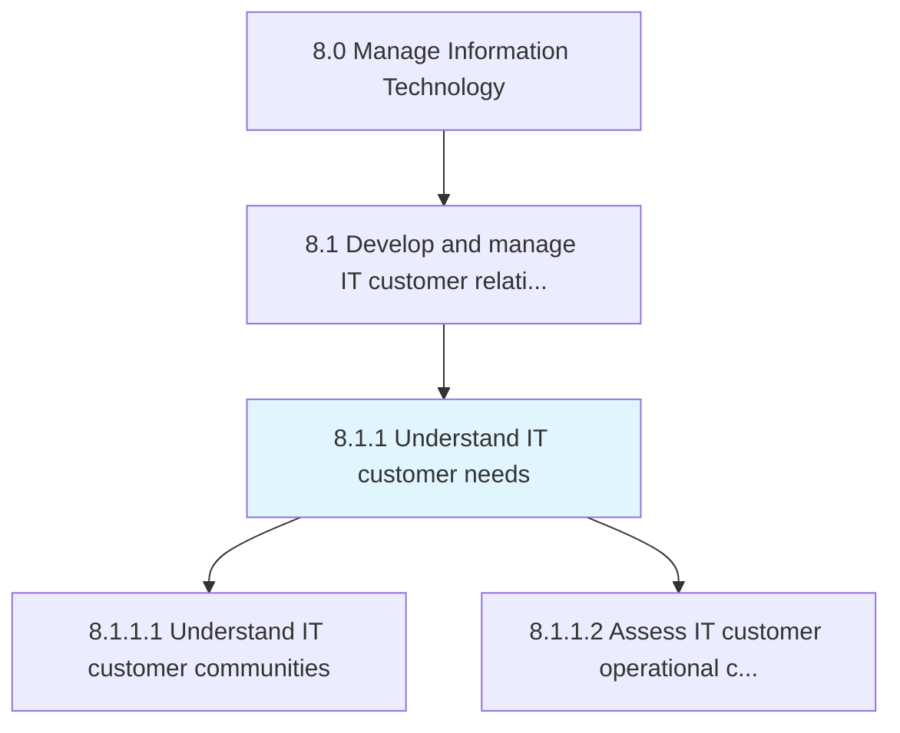
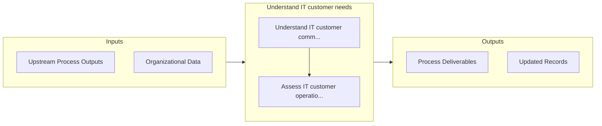

# Understand IT customer needs

> Assessing the customer communities along with current IT operational capabilities and usage.

## Overview

Process 8.1.1 is a core process that defines the specific procedures for understand it customer needs. 

Assessing the customer communities along with current IT operational capabilities and usage.

## Process Hierarchy



## Key Statistics

| Metric | Value |
|--------|-------|
| APQC Code | 20609 |
| Hierarchy ID | 8.1.1 |
| Level | Process |
| Parent | [8.1](../) |
| Sub-Processes | 2 |


## GraphDL Semantic Structure

```
understand.ITCustomerNeeds
```

| Component | Value | Description |
|-----------|-------|-------------|
| Verb | `understand` | Primary action |
| Object | `IT customer needs` | Direct object |


## Process Flow



## Sub-Processes

| Process | Hierarchy ID | Description |
|---------|-------------|-------------|
| [Understand IT customer communities](./UnderstandITCustomerCommunities) | 8.1.1.1 | Interacting with IT customers to understand the IT needs through a collaborative community through i |
| [Assess IT customer operational capabilities](./AssessITCustomerOperationalCapabilities) | 8.1.1.2 | Evaluate the ability of the group of staff dependent on information technology, to align resources a |


## Related Concepts

- [ITCustomerNeeds](/concepts/ITCustomerNeeds)


---

*Source: APQC PCF 20609 (8.1.1) - APQC*
