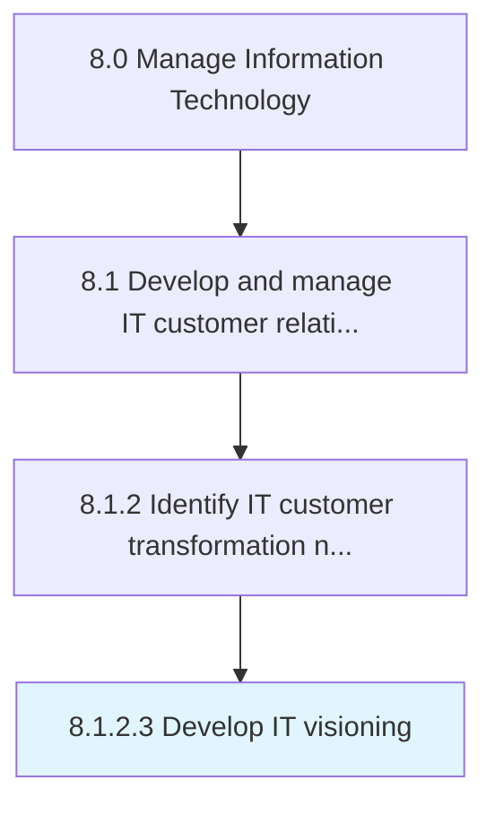

# Develop IT visioning

> Developing goals to define IT vision.

## Overview

Activity 8.1.2.3 is an activity within the Manage Information Technology framework. 

Developing goals to define IT vision. Define and document ideas, direction, and activities which enable information technology to reach these goals.

## Process Hierarchy



## Key Statistics

| Metric | Value |
|--------|-------|
| APQC Code | 20615 |
| Hierarchy ID | 8.1.2.3 |
| Level | Activity |
| Parent | [8.1.2](../) |
| Sub-Processes | 0 |


## GraphDL Semantic Structure

```
develop.ITVisioning
```

| Component | Value | Description |
|-----------|-------|-------------|
| Verb | `develop` | Primary action |
| Object | `IT visioning` | Direct object |


## Related Concepts

- [ITVisioning](/concepts/ITVisioning)


---

*Source: APQC PCF 20615 (8.1.2.3) - APQC*
