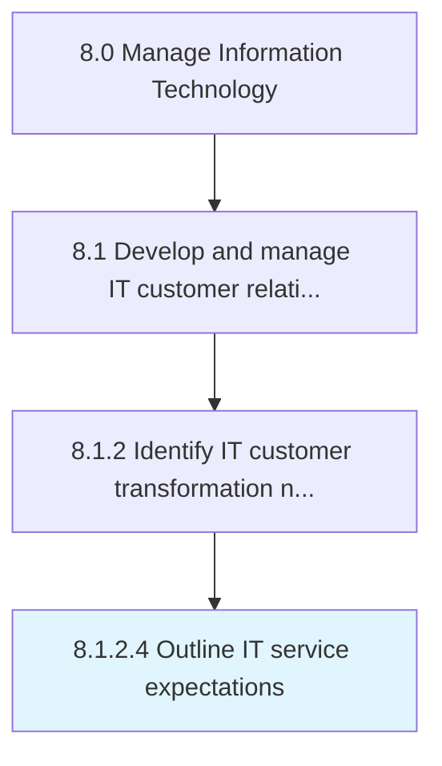

# Outline IT service expectations

> Defining a roadmap to meet organizational expectations from information technology services while considering how it will affect the business.

## Overview

Activity 8.1.2.4 is an activity within the Manage Information Technology framework. 

Defining a roadmap to meet organizational expectations from information technology services while considering how it will affect the business.

## Process Hierarchy



## Key Statistics

| Metric | Value |
|--------|-------|
| APQC Code | 20616 |
| Hierarchy ID | 8.1.2.4 |
| Level | Activity |
| Parent | [8.1.2](../) |
| Sub-Processes | 0 |


## GraphDL Semantic Structure

```
outline.ITServiceExpectations
```

| Component | Value | Description |
|-----------|-------|-------------|
| Verb | `outline` | Primary action |
| Object | `IT service expectations` | Direct object |


## Related Concepts

- [ITServiceExpectations](/concepts/ITServiceExpectations)


---

*Source: APQC PCF 20616 (8.1.2.4) - APQC*
