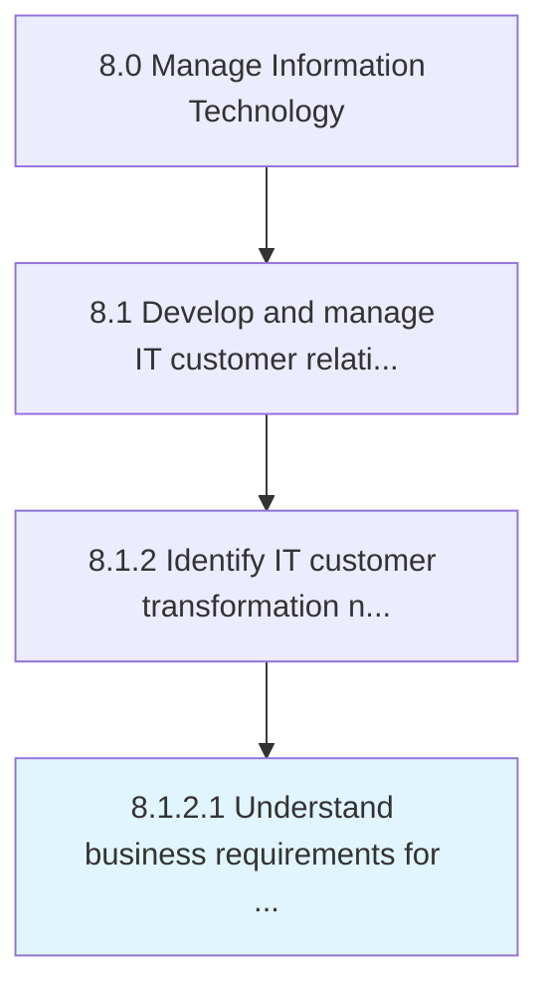

# Understand business requirements for IT capabilities

> Understanding business requirements for the existing IT environment as well as future IT needs.

## Overview

Activity 8.1.2.1 is an activity within the Manage Information Technology framework. 

Understanding business requirements for the existing IT environment as well as future IT needs.

## Process Hierarchy



## Key Statistics

| Metric | Value |
|--------|-------|
| APQC Code | 20613 |
| Hierarchy ID | 8.1.2.1 |
| Level | Activity |
| Parent | [8.1.2](../) |
| Sub-Processes | 0 |


## GraphDL Semantic Structure

```
understand.BusinessRequirements.for.ITCapabilities
```

| Component | Value | Description |
|-----------|-------|-------------|
| Verb | `understand` | Primary action |
| Object | `business requirements` | Direct object |
| Preposition | `for` | Relationship |
| PrepObject | `IT capabilities` | Indirect object |


## Related Concepts

- [BusinessRequirements](/concepts/BusinessRequirements)
- [ITCapabilities](/concepts/ITCapabilities)


---

*Source: APQC PCF 20613 (8.1.2.1) - APQC*
