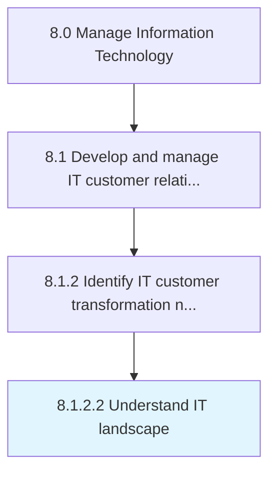

# Understand IT landscape

> Understanding the complete logical structure and working of the organization's IT landscape.

## Overview

Activity 8.1.2.2 is an activity within the Manage Information Technology framework. 

Understanding the complete logical structure and working of the organization's IT landscape. Assess the configuration of hardware and software (IT Assets) across the organization that supports overall business operations.

## Process Hierarchy



## Key Statistics

| Metric | Value |
|--------|-------|
| APQC Code | 20614 |
| Hierarchy ID | 8.1.2.2 |
| Level | Activity |
| Parent | [8.1.2](../) |
| Sub-Processes | 0 |


## GraphDL Semantic Structure

```
understand.ITLandscape
```

| Component | Value | Description |
|-----------|-------|-------------|
| Verb | `understand` | Primary action |
| Object | `IT landscape` | Direct object |


## Related Concepts

- ITLandscape


---

*Source: APQC PCF 20614 (8.1.2.2) - APQC*
