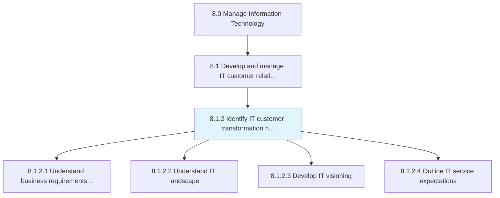
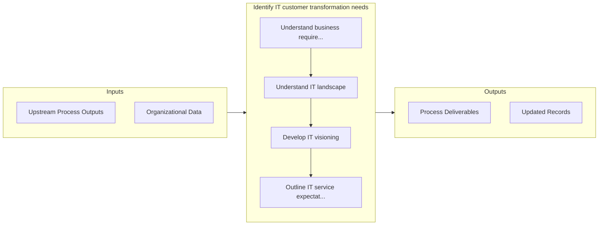

# Identify IT customer transformation needs

> Identifying changing needs of staff dependent on information technology based on continuous improvement to deliver results according to organizational goals.

## Overview

Process 8.1.2 is a core process that defines the specific procedures for identify it customer transformation needs. 

Identifying changing needs of staff dependent on information technology based on continuous improvement to deliver results according to organizational goals.

## Process Hierarchy



## Key Statistics

| Metric | Value |
|--------|-------|
| APQC Code | 20612 |
| Hierarchy ID | 8.1.2 |
| Level | Process |
| Parent | [8.1](../) |
| Sub-Processes | 4 |


## GraphDL Semantic Structure

```graphdl
identify.ITCustomerTransformationNeeds
```

| Component | Value | Description |
|-----------|-------|-------------|
| Verb | `identify` | Primary action |
| Object | `IT customer transformation needs` | Direct object |


## Process Flow



## Sub-Processes

| Process | Hierarchy ID | Description |
|---------|-------------|-------------|
| [Understand business requirements for IT capabilities](./UnderstandBusinessRequirementsForITCapabilities) | 8.1.2.1 | Understanding business requirements for the existing IT environment as well as future IT needs |
| [Understand IT landscape](./UnderstandITLandscape) | 8.1.2.2 | Understanding the complete logical structure and working of the organization's IT landscape |
| [Develop IT visioning](./DevelopITVisioning) | 8.1.2.3 | Developing goals to define IT vision |
| [Outline IT service expectations](./OutlineITServiceExpectations) | 8.1.2.4 | Defining a roadmap to meet organizational expectations from information technology services while co |


## Related Concepts

- ITCustomerTransformationNeeds


---

*Source: APQC PCF 20612 (8.1.2) - APQC*
