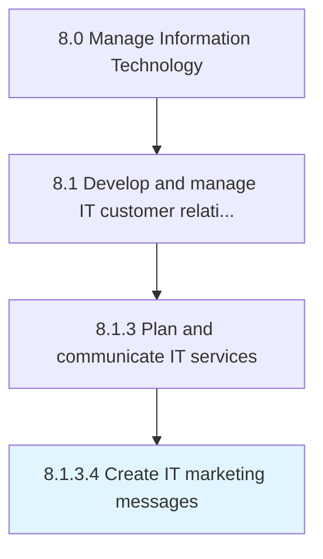

# Create IT marketing messages

> Developing concise statements that position the value proposition around the pressing concerns of the internal IT user base, thereby showing how the IT offerings are the right fit for a segment of IT customers.

## Overview

Activity 8.1.3.4 is an activity within the Manage Information Technology framework. 

Developing concise statements that position the value proposition around the pressing concerns of the internal IT user base, thereby showing how the IT offerings are the right fit for a segment of IT customers.

## Process Hierarchy



## Key Statistics

| Metric | Value |
|--------|-------|
| APQC Code | 20621 |
| Hierarchy ID | 8.1.3.4 |
| Level | Activity |
| Parent | [8.1.3](../) |
| Sub-Processes | 0 |


## GraphDL Semantic Structure

```
create.ITMarketingMessages
```

| Component | Value | Description |
|-----------|-------|-------------|
| Verb | `create` | Primary action |
| Object | `IT marketing messages` | Direct object |


## Related Concepts

- [ITMarketingMessages](/concepts/ITMarketingMessages)


---

*Source: APQC PCF 20621 (8.1.3.4) - APQC*
