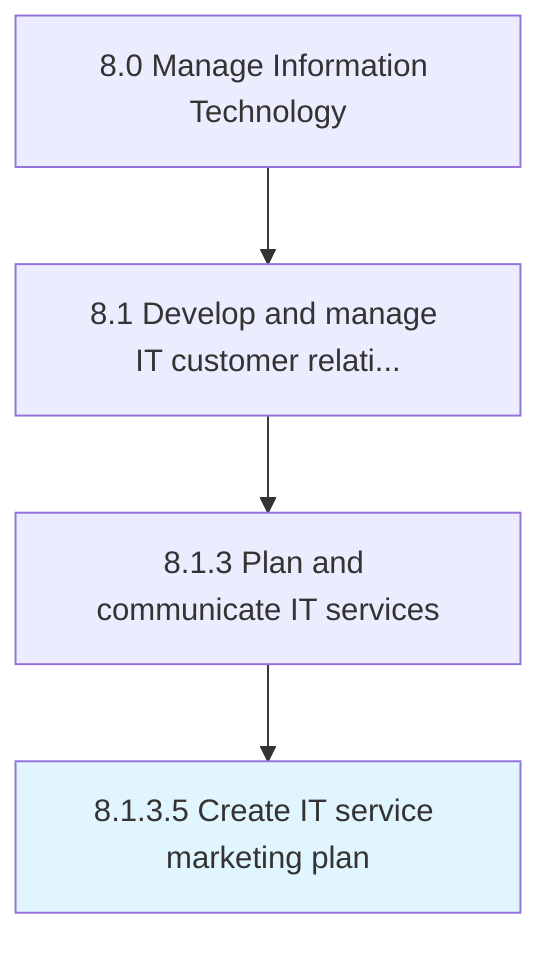

# Create IT service marketing plan

> Creating a marketing strategy for IT offerings to customers.

## Overview

Activity 8.1.3.5 is an activity within the Manage Information Technology framework. 

Creating a marketing strategy for IT offerings to customers. Plan processes for making budgets; identifying and developing media; and managing marketing content and promotional activities.

## Process Hierarchy



## Key Statistics

| Metric | Value |
|--------|-------|
| APQC Code | 20622 |
| Hierarchy ID | 8.1.3.5 |
| Level | Activity |
| Parent | [8.1.3](../) |
| Sub-Processes | 0 |


## GraphDL Semantic Structure

```
create.ITServiceMarketingPlan
```

| Component | Value | Description |
|-----------|-------|-------------|
| Verb | `create` | Primary action |
| Object | `IT service marketing plan` | Direct object |


## Related Concepts

- [ITServiceMarketingPlan](/concepts/ITServiceMarketingPlan)


---

*Source: APQC PCF 20622 (8.1.3.5) - APQC*
