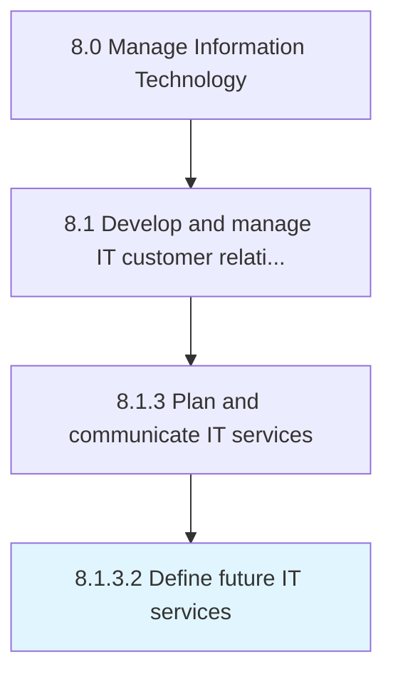

# Define future IT services

> Defining the expected demand and usage of information technology services to meet organization's future business goals.

## Overview

Activity 8.1.3.2 is an activity within the Manage Information Technology framework. 

Defining the expected demand and usage of information technology services to meet organization's future business goals. Gather necessary information about the processes, resource requirements, and structures pertaining to planned business growth.

## Process Hierarchy



## Key Statistics

| Metric | Value |
|--------|-------|
| APQC Code | 20619 |
| Hierarchy ID | 8.1.3.2 |
| Level | Activity |
| Parent | [8.1.3](../) |
| Sub-Processes | 0 |


## GraphDL Semantic Structure

```
define.FutureITServices
```

| Component | Value | Description |
|-----------|-------|-------------|
| Verb | `define` | Primary action |
| Object | `future IT services` | Direct object |


## Related Concepts

- [FutureITServices](/concepts/FutureITServices)


---

*Source: APQC PCF 20619 (8.1.3.2) - APQC*
