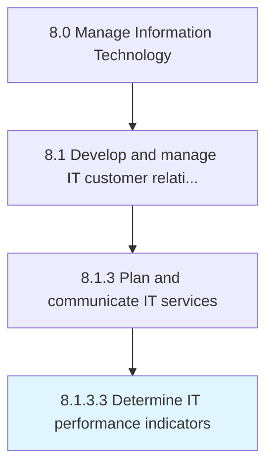

# Determine IT performance indicators

> Determining IT KPIs crucial to the organization's success.

## Overview

Activity 8.1.3.3 is an activity within the Manage Information Technology framework. 

Determining IT KPIs crucial to the organization's success. Measure indicators such as IT costs as percentage of revenue, IT maintenance ratio, and system downtime in an effort to evaluate the performance of IT across the organization.

## Process Hierarchy



## Key Statistics

| Metric | Value |
|--------|-------|
| APQC Code | 20620 |
| Hierarchy ID | 8.1.3.3 |
| Level | Activity |
| Parent | [8.1.3](../) |
| Sub-Processes | 0 |


## GraphDL Semantic Structure

```
determine.ITPerformanceIndicators
```

| Component | Value | Description |
|-----------|-------|-------------|
| Verb | `determine` | Primary action |
| Object | `IT performance indicators` | Direct object |


## Related Concepts

- ITPerformanceIndicators


---

*Source: APQC PCF 20620 (8.1.3.3) - APQC*
