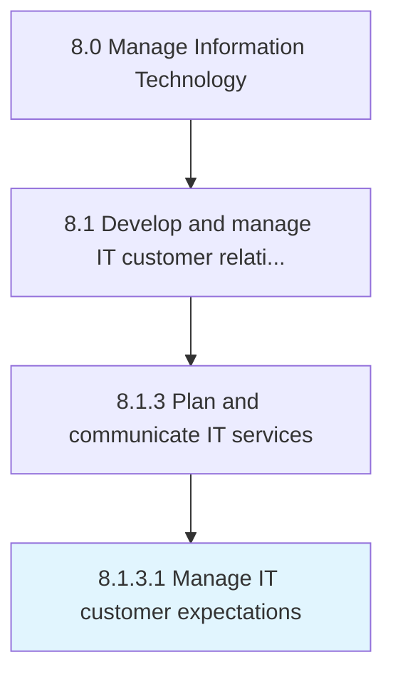

# Manage IT customer expectations

> Managing customer expectations of the existing IT environment while considering how it will affect the business.

## Overview

Activity 8.1.3.1 is an activity within the Manage Information Technology framework. 

Managing customer expectations of the existing IT environment while considering how it will affect the business.

## Process Hierarchy



## Key Statistics

| Metric | Value |
|--------|-------|
| APQC Code | 20618 |
| Hierarchy ID | 8.1.3.1 |
| Level | Activity |
| Parent | [8.1.3](../) |
| Sub-Processes | 0 |


## GraphDL Semantic Structure

```
manage.ITCustomerExpectations
```

| Component | Value | Description |
|-----------|-------|-------------|
| Verb | `manage` | Primary action |
| Object | `IT customer expectations` | Direct object |


## Related Concepts

- ITCustomerExpectations


---

*Source: APQC PCF 20618 (8.1.3.1) - APQC*
