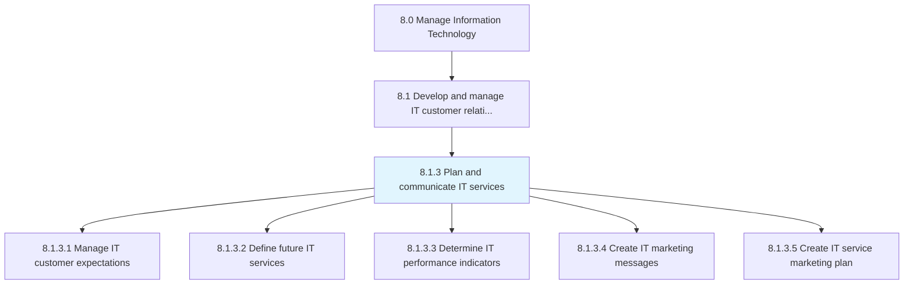
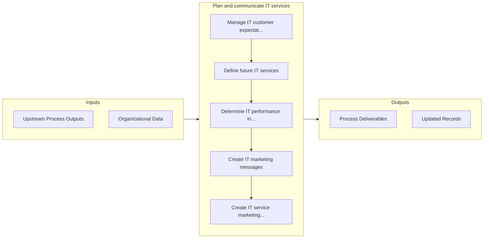

# Plan and communicate IT services

> Create and design an organized and curated collection of all IT-related services that can be performed by, for, or within the organization.

## Overview

Process 8.1.3 is a core process that defines the specific procedures for plan and communicate it services. 

Create and design an organized and curated collection of all IT-related services that can be performed by, for, or within the organization. Maintain and convey information about deliverables, prices, contact points, and processes for requesting an information technology service.

## Process Hierarchy



## Key Statistics

| Metric | Value |
|--------|-------|
| APQC Code | 20617 |
| Hierarchy ID | 8.1.3 |
| Level | Process |
| Parent | [8.1](../) |
| Sub-Processes | 5 |


## GraphDL Semantic Structure

```
plan.AndCommunicateITServices
```

| Component | Value | Description |
|-----------|-------|-------------|
| Verb | `plan` | Primary action |
| Object | `and communicate IT services` | Direct object |


## Process Flow



## Sub-Processes

| Process | Hierarchy ID | Description |
|---------|-------------|-------------|
| [Manage IT customer expectations](./ManageITCustomerExpectations) | 8.1.3.1 | Managing customer expectations of the existing IT environment while considering how it will affect t |
| [Define future IT services](./DefineFutureITServices) | 8.1.3.2 | Defining the expected demand and usage of information technology services to meet organization's fut |
| [Determine IT performance indicators](./DetermineITPerformanceIndicators) | 8.1.3.3 | Determining IT KPIs crucial to the organization's success |
| [Create IT marketing messages](./CreateITMarketingMessages) | 8.1.3.4 | Developing concise statements that position the value proposition around the pressing concerns of th |
| [Create IT service marketing plan](./CreateITServiceMarketingPlan) | 8.1.3.5 | Creating a marketing strategy for IT offerings to customers |


## Related Concepts

- ITServices
- ITServices


---

*Source: APQC PCF 20617 (8.1.3) - APQC*
