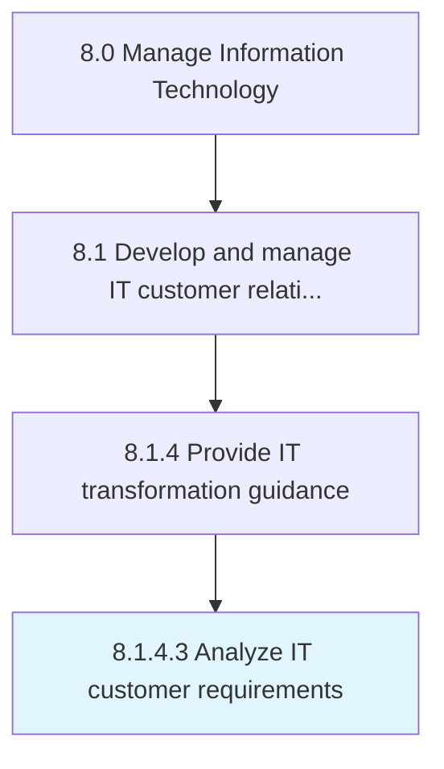

# Analyze IT customer requirements

> Assessing identified IT gaps to plan for remediation efforts to allow outcomes to meet established performance levels.

## Overview

Activity 8.1.4.3 is an activity within the Manage Information Technology framework. 

Assessing identified IT gaps to plan for remediation efforts to allow outcomes to meet established performance levels.

## Process Hierarchy



## Key Statistics

| Metric | Value |
|--------|-------|
| APQC Code | 20937 |
| Hierarchy ID | 8.1.4.3 |
| Level | Activity |
| Parent | [8.1.4](../) |
| Sub-Processes | 0 |


## GraphDL Semantic Structure

```
analyze.ITCustomerRequirements
```

| Component | Value | Description |
|-----------|-------|-------------|
| Verb | `analyze` | Primary action |
| Object | `IT customer requirements` | Direct object |


## Related Concepts

- [ITCustomerRequirements](/concepts/ITCustomerRequirements)


---

*Source: APQC PCF 20937 (8.1.4.3) - APQC*
