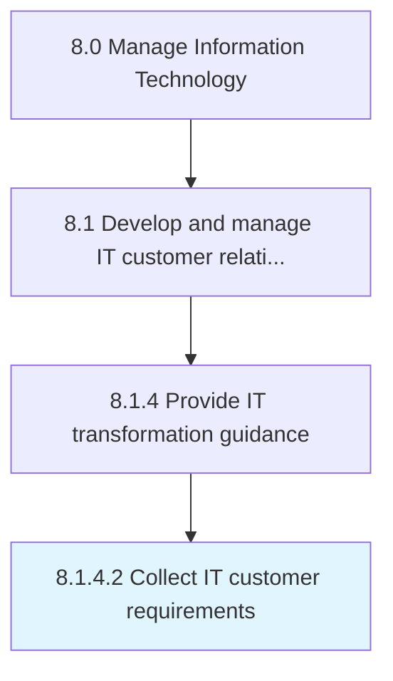

# Collect IT customer requirements

> Identifying existing or potential IT gaps between the expected business performance levels and current business outcomes.

## Overview

Activity 8.1.4.2 is an activity within the Manage Information Technology framework. 

Identifying existing or potential IT gaps between the expected business performance levels and current business outcomes.

## Process Hierarchy



## Key Statistics

| Metric | Value |
|--------|-------|
| APQC Code | 20625 |
| Hierarchy ID | 8.1.4.2 |
| Level | Activity |
| Parent | [8.1.4](../) |
| Sub-Processes | 0 |


## GraphDL Semantic Structure

```
collect.ITCustomerRequirements
```

| Component | Value | Description |
|-----------|-------|-------------|
| Verb | `collect` | Primary action |
| Object | `IT customer requirements` | Direct object |


## Related Concepts

- [ITCustomerRequirements](/concepts/ITCustomerRequirements)


---

*Source: APQC PCF 20625 (8.1.4.2) - APQC*
