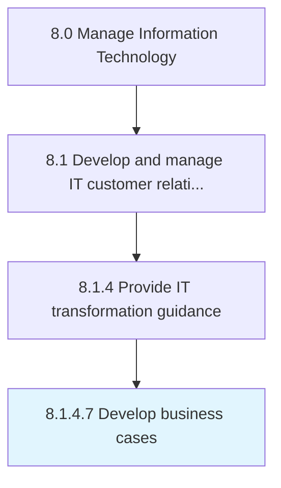

# Develop business cases

> Create a business case with value proposition indicating current situation, proposed solution, financial analysis, and measurable benefits to the IT customers.

## Overview

Activity 8.1.4.7 is an activity within the Manage Information Technology framework. 

Create a business case with value proposition indicating current situation, proposed solution, financial analysis, and measurable benefits to the IT customers.

## Process Hierarchy



## Key Statistics

| Metric | Value |
|--------|-------|
| APQC Code | 20629 |
| Hierarchy ID | 8.1.4.7 |
| Level | Activity |
| Parent | [8.1.4](../) |
| Sub-Processes | 0 |


## GraphDL Semantic Structure

```
develop.BusinessCases
```

| Component | Value | Description |
|-----------|-------|-------------|
| Verb | `develop` | Primary action |
| Object | `business cases` | Direct object |


## Related Concepts

- BusinessCases


---

*Source: APQC PCF 20629 (8.1.4.7) - APQC*
