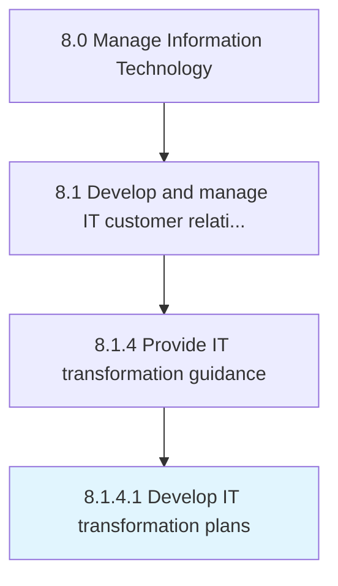

# Develop IT transformation plans

> Developing a robust plan to replace or upgrade an organization's information technology systems.

## Overview

Activity 8.1.4.1 is an activity within the Manage Information Technology framework. 

Developing a robust plan to replace or upgrade an organization's information technology systems. Understanding the business need of IT transformation from current to an expected state for the business. Developing a strategic plan for IT operating model, governance, service delivery, and workforce transformation.

## Process Hierarchy



## Key Statistics

| Metric | Value |
|--------|-------|
| APQC Code | 20624 |
| Hierarchy ID | 8.1.4.1 |
| Level | Activity |
| Parent | [8.1.4](../) |
| Sub-Processes | 0 |


## GraphDL Semantic Structure

```
develop.ITTransformationPlans
```

| Component | Value | Description |
|-----------|-------|-------------|
| Verb | `develop` | Primary action |
| Object | `IT transformation plans` | Direct object |


## Related Concepts

- ITTransformationPlans


---

*Source: APQC PCF 20624 (8.1.4.1) - APQC*
