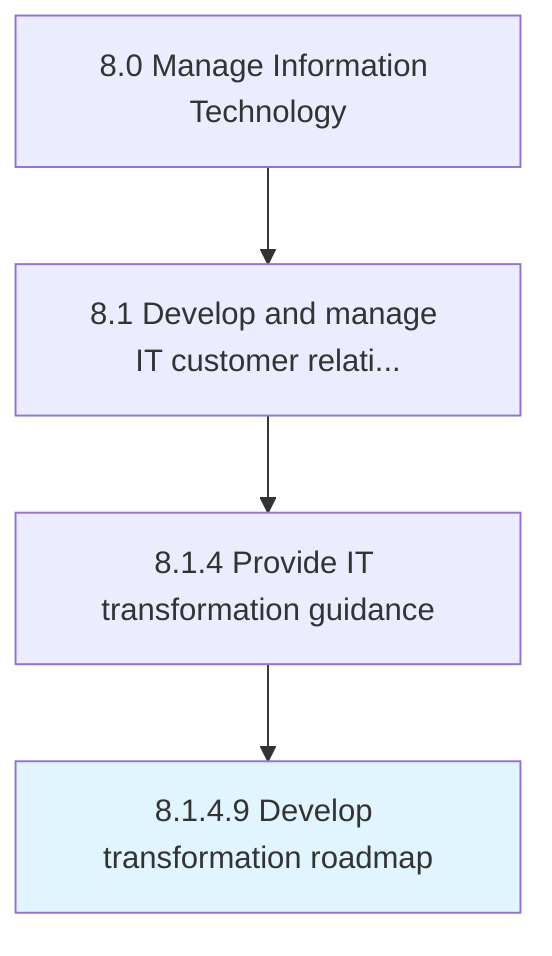

# Develop transformation roadmap

> Creating a blueprint for execution of IT transformation from the existing state to the planned organizational structure based on the value proposition and projected business growth.

## Overview

Activity 8.1.4.9 is an activity within the Manage Information Technology framework. 

Creating a blueprint for execution of IT transformation from the existing state to the planned organizational structure based on the value proposition and projected business growth.

## Process Hierarchy



## Key Statistics

| Metric | Value |
|--------|-------|
| APQC Code | 20631 |
| Hierarchy ID | 8.1.4.9 |
| Level | Activity |
| Parent | [8.1.4](../) |
| Sub-Processes | 0 |


## GraphDL Semantic Structure

```
develop.TransformationRoadmap
```

| Component | Value | Description |
|-----------|-------|-------------|
| Verb | `develop` | Primary action |
| Object | `transformation roadmap` | Direct object |


## Related Concepts

- TransformationRoadmap


---

*Source: APQC PCF 20631 (8.1.4.9) - APQC*
