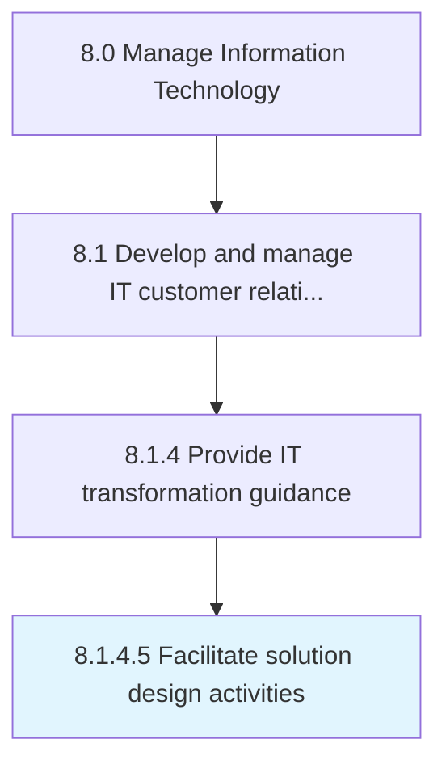

# Facilitate solution design activities

> Providing a plan of action to provide solution to IT customers.

## Overview

Activity 8.1.4.5 is an activity within the Manage Information Technology framework. 

Providing a plan of action to provide solution to IT customers. The solution design should be based on the collection and analysis of IT customer requirements.

## Process Hierarchy



## Key Statistics

| Metric | Value |
|--------|-------|
| APQC Code | 20627 |
| Hierarchy ID | 8.1.4.5 |
| Level | Activity |
| Parent | [8.1.4](../) |
| Sub-Processes | 0 |


## GraphDL Semantic Structure

```
facilitate.SolutionDesignActivities
```

| Component | Value | Description |
|-----------|-------|-------------|
| Verb | `facilitate` | Primary action |
| Object | `solution design activities` | Direct object |


## Related Concepts

- [SolutionDesignActivities](/concepts/SolutionDesignActivities)


---

*Source: APQC PCF 20627 (8.1.4.5) - APQC*
