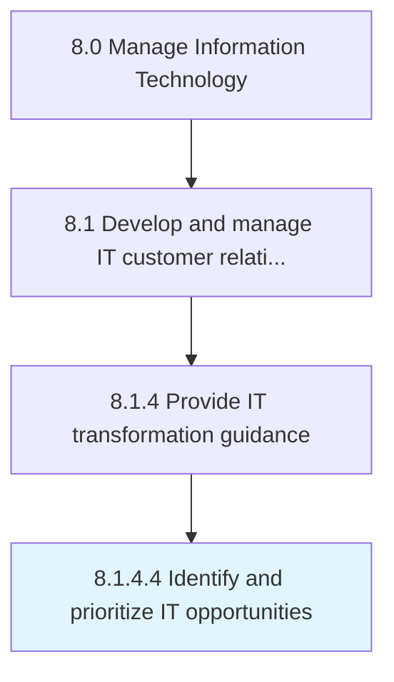

# Identify and prioritize IT opportunities

> Identifying IT opportunities on the basis of collection and analysis of IT customer requirements, then prioritize the identified IT opportunities on the basis of their importance.

## Overview

Activity 8.1.4.4 is an activity within the Manage Information Technology framework. 

Identifying IT opportunities on the basis of collection and analysis of IT customer requirements, then prioritize the identified IT opportunities on the basis of their importance.

## Process Hierarchy



## Key Statistics

| Metric | Value |
|--------|-------|
| APQC Code | 20626 |
| Hierarchy ID | 8.1.4.4 |
| Level | Activity |
| Parent | [8.1.4](../) |
| Sub-Processes | 0 |


## GraphDL Semantic Structure

```
identify.AndPrioritizeITOpportunities
```

| Component | Value | Description |
|-----------|-------|-------------|
| Verb | `identify` | Primary action |
| Object | `and prioritize IT opportunities` | Direct object |


## Related Concepts

- ITOpportunities
- ITOpportunities


---

*Source: APQC PCF 20626 (8.1.4.4) - APQC*
