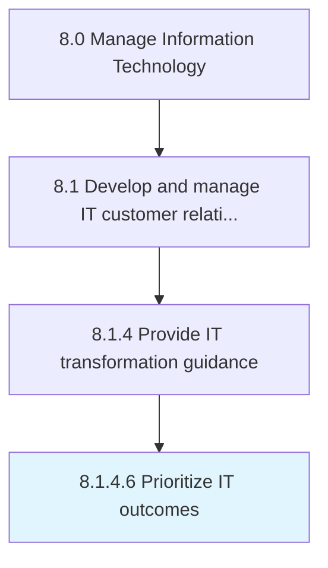

# Prioritize IT outcomes

> Prioritizing IT outcomes based on need, effectiveness, and efficiency.

## Overview

Activity 8.1.4.6 is an activity within the Manage Information Technology framework. 

Prioritizing IT outcomes based on need, effectiveness, and efficiency.

## Process Hierarchy



## Key Statistics

| Metric | Value |
|--------|-------|
| APQC Code | 20628 |
| Hierarchy ID | 8.1.4.6 |
| Level | Activity |
| Parent | [8.1.4](../) |
| Sub-Processes | 0 |


## GraphDL Semantic Structure

```
prioritize.ITOutcomes
```

| Component | Value | Description |
|-----------|-------|-------------|
| Verb | `prioritize` | Primary action |
| Object | `IT outcomes` | Direct object |


## Related Concepts

- [ITOutcomes](/concepts/ITOutcomes)


---

*Source: APQC PCF 20628 (8.1.4.6) - APQC*
