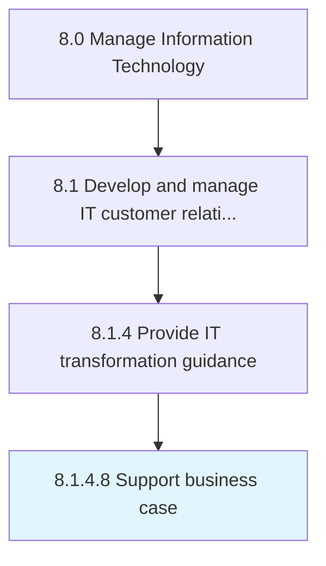

# Support business case

> Supporting business case with supporting research, business analysis, and background information on IT transformation.

## Overview

Activity 8.1.4.8 is an activity within the Manage Information Technology framework. 

Supporting business case with supporting research, business analysis, and background information on IT transformation.

## Process Hierarchy



## Key Statistics

| Metric | Value |
|--------|-------|
| APQC Code | 20630 |
| Hierarchy ID | 8.1.4.8 |
| Level | Activity |
| Parent | [8.1.4](../) |
| Sub-Processes | 0 |


## GraphDL Semantic Structure

```
support.BusinessCase
```

| Component | Value | Description |
|-----------|-------|-------------|
| Verb | `support` | Primary action |
| Object | `business case` | Direct object |


## Related Concepts

- BusinessCase


---

*Source: APQC PCF 20630 (8.1.4.8) - APQC*
