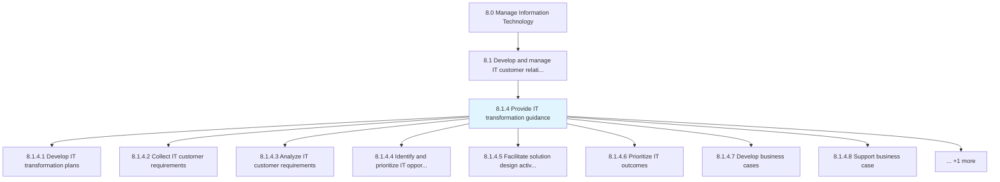
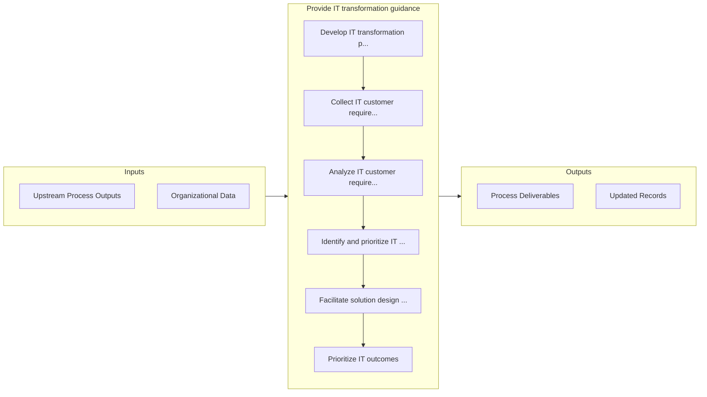

# Provide IT transformation guidance

> Understanding the necessity of IT transformation for the business.

## Overview

Process 8.1.4 is a core process that defines the specific procedures for provide it transformation guidance. 

Understanding the necessity of IT transformation for the business. Collect and analyze customer requirements. Identify opportunities and prioritize outcomes. Develop and support business case for transformation. Develop transformation plan and roadmap.

## Process Hierarchy



## Key Statistics

| Metric | Value |
|--------|-------|
| APQC Code | 20623 |
| Hierarchy ID | 8.1.4 |
| Level | Process |
| Parent | [8.1](../) |
| Sub-Processes | 9 |


## GraphDL Semantic Structure

```graphdl
provide.ITTransformationGuidance
```

| Component | Value | Description |
|-----------|-------|-------------|
| Verb | `provide` | Primary action |
| Object | `IT transformation guidance` | Direct object |


## Process Flow



## Sub-Processes

| Process | Hierarchy ID | Description |
|---------|-------------|-------------|
| [Develop IT transformation plans](./DevelopITTransformationPlans) | 8.1.4.1 | Developing a robust plan to replace or upgrade an organization's information technology systems |
| [Collect IT customer requirements](./CollectITCustomerRequirements) | 8.1.4.2 | Identifying existing or potential IT gaps between the expected business performance levels and curre |
| [Analyze IT customer requirements](./AnalyzeITCustomerRequirements) | 8.1.4.3 | Assessing identified IT gaps to plan for remediation efforts to allow outcomes to meet established p |
| [Identify and prioritize IT opportunities](./IdentifyAndPrioritizeITOpportunities) | 8.1.4.4 | Identifying IT opportunities on the basis of collection and analysis of IT customer requirements, th |
| [Facilitate solution design activities](./FacilitateSolutionDesignActivities) | 8.1.4.5 | Providing a plan of action to provide solution to IT customers |
| [Prioritize IT outcomes](./PrioritizeITOutcomes) | 8.1.4.6 | Prioritizing IT outcomes based on need, effectiveness, and efficiency |
| [Develop business cases](./DevelopBusinessCases) | 8.1.4.7 | Create a business case with value proposition indicating current situation, proposed solution, finan |
| [Support business case](./SupportBusinessCase) | 8.1.4.8 | Supporting business case with supporting research, business analysis, and background information on  |
| [Develop transformation roadmap](./DevelopTransformationRoadmap) | 8.1.4.9 | Creating a blueprint for execution of IT transformation from the existing state to the planned organ |


## Related Concepts

- ITTransformationGuidance


---

*Source: APQC PCF 20623 (8.1.4) - APQC*
