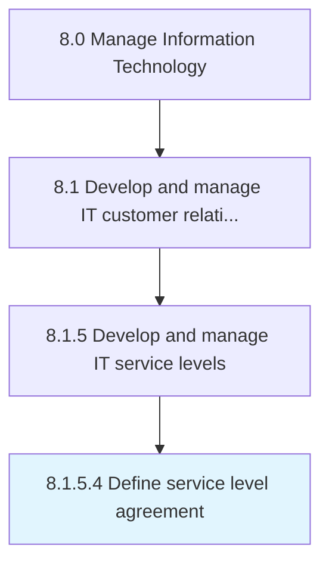

# Define service level agreement

> Designing and maintaining commitment of service by performance evaluation of IT services and communicate the results to the management.

## Overview

Activity 8.1.5.4 is an activity within the Manage Information Technology framework. 

Designing and maintaining commitment of service by performance evaluation of IT services and communicate the results to the management.

## Process Hierarchy



## Key Statistics

| Metric | Value |
|--------|-------|
| APQC Code | 20636 |
| Hierarchy ID | 8.1.5.4 |
| Level | Activity |
| Parent | [8.1.5](../) |
| Sub-Processes | 0 |


## GraphDL Semantic Structure

```
define.ServiceLevelAgreement
```

| Component | Value | Description |
|-----------|-------|-------------|
| Verb | `define` | Primary action |
| Object | `service level agreement` | Direct object |


## Related Concepts

- [ServiceLevelAgreement](/concepts/ServiceLevelAgreement)


---

*Source: APQC PCF 20636 (8.1.5.4) - APQC*
