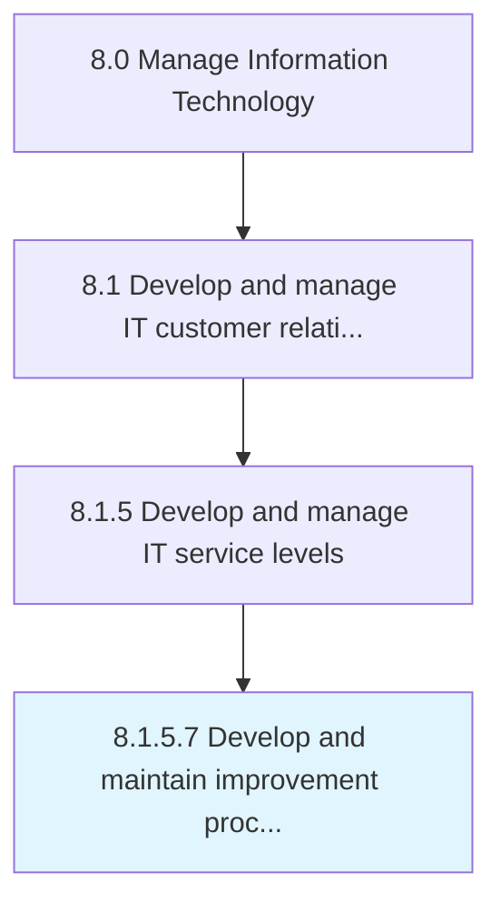

# Develop and maintain improvement processes

> Conveying the improvement opportunities for the business and level of IT services.

## Overview

Activity 8.1.5.7 is an activity within the Manage Information Technology framework. 

Conveying the improvement opportunities for the business and level of IT services. Leverage the results obtained from the performance metrics of the business and IT service levels to identify and recognize any opportunities that would improve or enhance the efficiency of the business and IT service-level structure. Communicate these opportunities to management in order for the improvements to take effect.

## Process Hierarchy



## Key Statistics

| Metric | Value |
|--------|-------|
| APQC Code | 20640 |
| Hierarchy ID | 8.1.5.7 |
| Level | Activity |
| Parent | [8.1.5](../) |
| Sub-Processes | 0 |


## GraphDL Semantic Structure

```
develop.AndMaintainImprovementProcesses
```

| Component | Value | Description |
|-----------|-------|-------------|
| Verb | `develop` | Primary action |
| Object | `and maintain improvement processes` | Direct object |


## Related Concepts

- ImprovementProcesses
- ImprovementProcesses


---

*Source: APQC PCF 20640 (8.1.5.7) - APQC*
