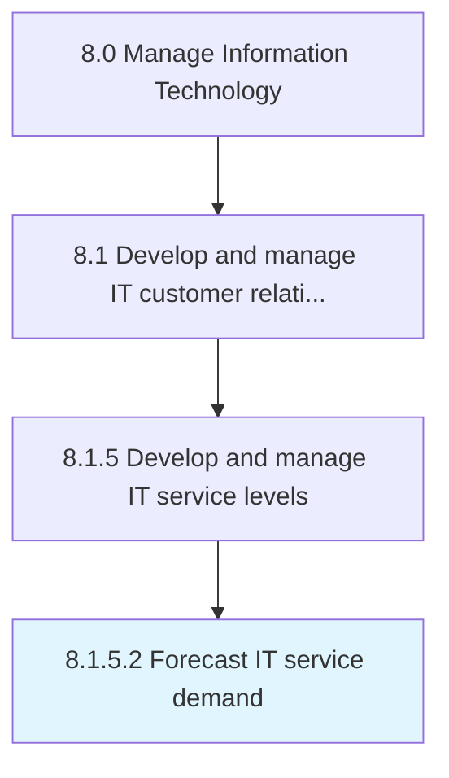

# Forecast IT service demand

> Forecasting demand for IT services using current business growth, research, and customer feedback.

## Overview

Activity 8.1.5.2 is an activity within the Manage Information Technology framework. 

Forecasting demand for IT services using current business growth, research, and customer feedback. Refine these forecasts, inspect the approach used in creating forecasts, and determine its accuracy.

## Process Hierarchy



## Key Statistics

| Metric | Value |
|--------|-------|
| APQC Code | 20634 |
| Hierarchy ID | 8.1.5.2 |
| Level | Activity |
| Parent | [8.1.5](../) |
| Sub-Processes | 0 |


## GraphDL Semantic Structure

```
forecast.ITServiceDemand
```

| Component | Value | Description |
|-----------|-------|-------------|
| Verb | `forecast` | Primary action |
| Object | `IT service demand` | Direct object |


## Related Concepts

- [ITServiceDemand](/concepts/ITServiceDemand)


---

*Source: APQC PCF 20634 (8.1.5.2) - APQC*
