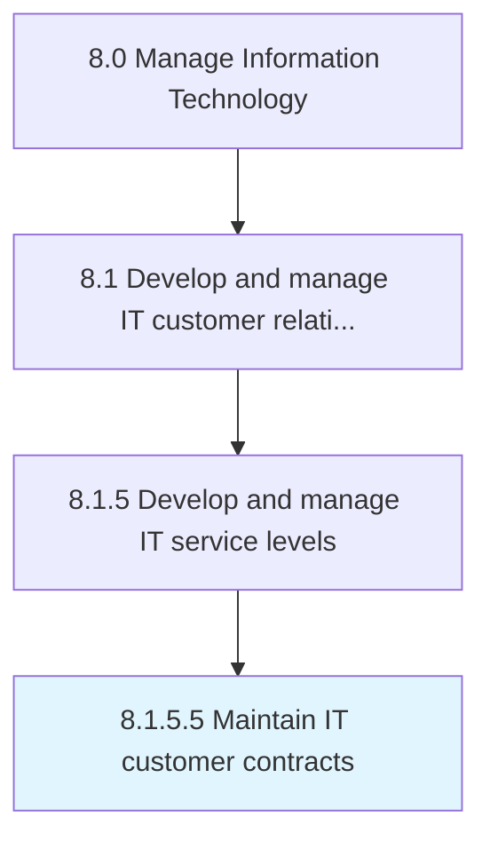

# Maintain IT customer contracts

> Maintaining and documenting commitment of service to staff for information technology contracts including providing software or hardware solution through communication channels like phone, email, and on-site services.

## Overview

Activity 8.1.5.5 is an activity within the Manage Information Technology framework. 

Maintaining and documenting commitment of service to staff for information technology contracts including providing software or hardware solution through communication channels like phone, email, and on-site services.

## Process Hierarchy



## Key Statistics

| Metric | Value |
|--------|-------|
| APQC Code | 20637 |
| Hierarchy ID | 8.1.5.5 |
| Level | Activity |
| Parent | [8.1.5](../) |
| Sub-Processes | 0 |


## GraphDL Semantic Structure

```
maintain.ITCustomerContracts
```

| Component | Value | Description |
|-----------|-------|-------------|
| Verb | `maintain` | Primary action |
| Object | `IT customer contracts` | Direct object |


## Related Concepts

- ITCustomerContracts


---

*Source: APQC PCF 20637 (8.1.5.5) - APQC*
