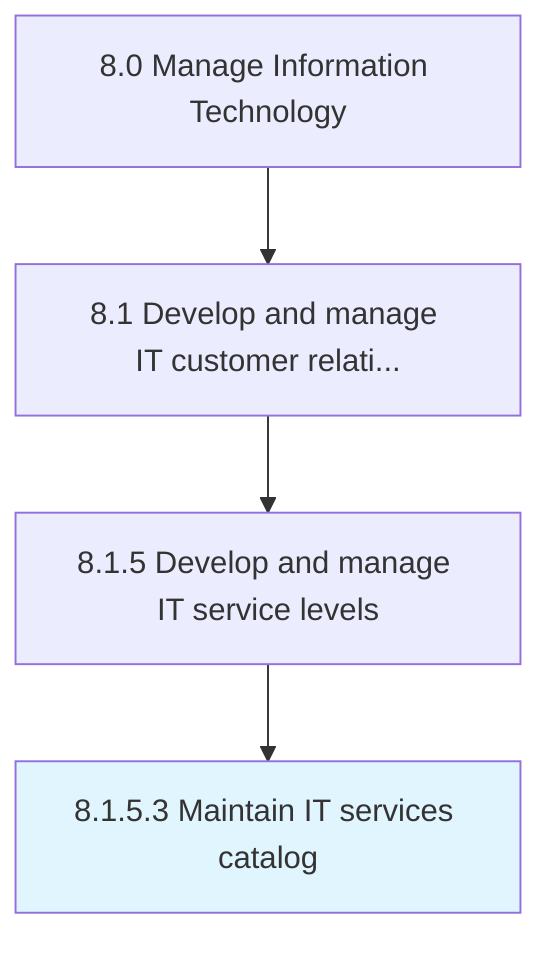

# Maintain IT services catalog

> Maintain information about IT deliverables, prices, contact points, and processes for requesting a service.

## Overview

Activity 8.1.5.3 is an activity within the Manage Information Technology framework. 

Maintain information about IT deliverables, prices, contact points, and processes for requesting a service.

## Process Hierarchy



## Key Statistics

| Metric | Value |
|--------|-------|
| APQC Code | 20635 |
| Hierarchy ID | 8.1.5.3 |
| Level | Activity |
| Parent | [8.1.5](../) |
| Sub-Processes | 0 |


## GraphDL Semantic Structure

```
maintain.ITServicesCatalog
```

| Component | Value | Description |
|-----------|-------|-------------|
| Verb | `maintain` | Primary action |
| Object | `IT services catalog` | Direct object |


## Related Concepts

- [ITServicesCatalog](/concepts/ITServicesCatalog)


---

*Source: APQC PCF 20635 (8.1.5.3) - APQC*
