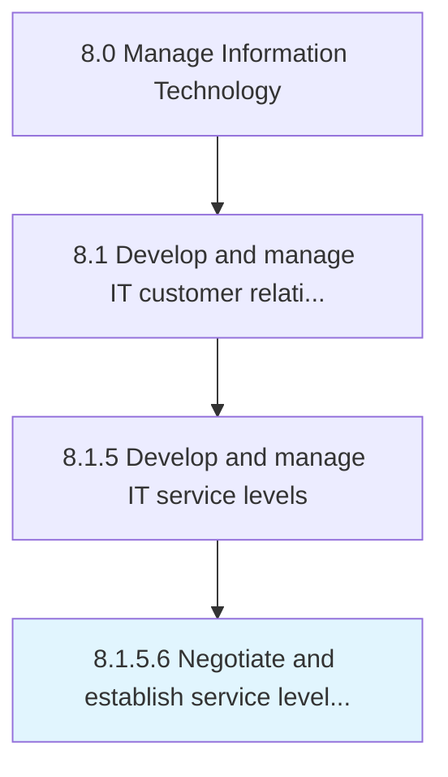

# Negotiate and establish service level agreements

> Establish a service level agreement, which is a negotiated agreement designed to create a common understanding about services, priorities, and responsibilities.

## Overview

Activity 8.1.5.6 is an activity within the Manage Information Technology framework. 

Establish a service level agreement, which is a negotiated agreement designed to create a common understanding about services, priorities, and responsibilities.

## Process Hierarchy



## Key Statistics

| Metric | Value |
|--------|-------|
| APQC Code | 20638 |
| Hierarchy ID | 8.1.5.6 |
| Level | Activity |
| Parent | [8.1.5](../) |
| Sub-Processes | 0 |


## GraphDL Semantic Structure

```
negotiate.AndEstablishServiceLevelAgreements
```

| Component | Value | Description |
|-----------|-------|-------------|
| Verb | `negotiate` | Primary action |
| Object | `and establish service level agreements` | Direct object |


## Related Concepts

- ServiceLevelAgreements
- ServiceLevelAgreements


---

*Source: APQC PCF 20638 (8.1.5.6) - APQC*
