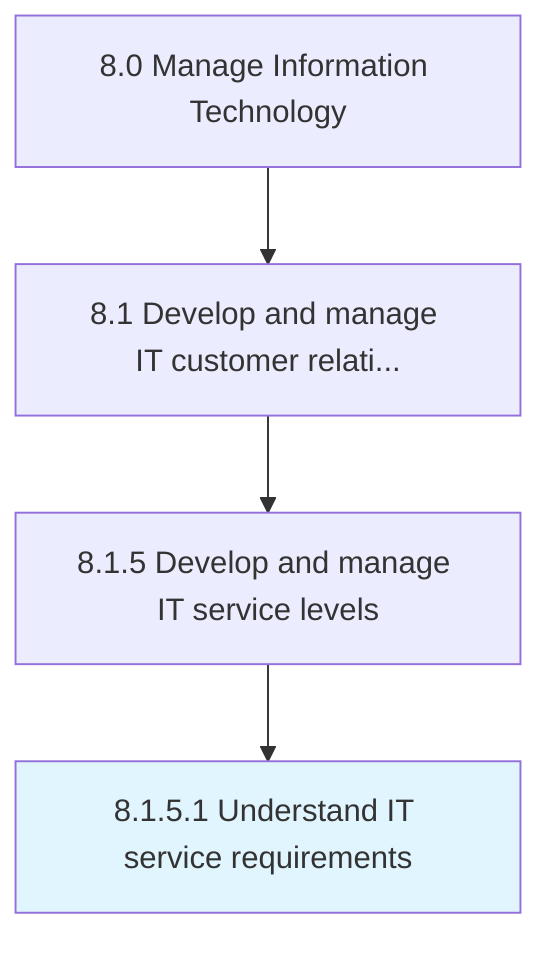

# Understand IT service requirements

> Understand requirements related to information technology services considering enterprise-level effects and understand potential achievements in the business environment.

## Overview

Activity 8.1.5.1 is an activity within the Manage Information Technology framework. 

Understand requirements related to information technology services considering enterprise-level effects and understand potential achievements in the business environment.

## Process Hierarchy



## Key Statistics

| Metric | Value |
|--------|-------|
| APQC Code | 20633 |
| Hierarchy ID | 8.1.5.1 |
| Level | Activity |
| Parent | [8.1.5](../) |
| Sub-Processes | 0 |


## GraphDL Semantic Structure

```
understand.ITServiceRequirements
```

| Component | Value | Description |
|-----------|-------|-------------|
| Verb | `understand` | Primary action |
| Object | `IT service requirements` | Direct object |


## Related Concepts

- ITServiceRequirements


---

*Source: APQC PCF 20633 (8.1.5.1) - APQC*
