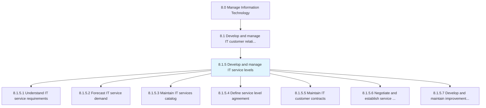
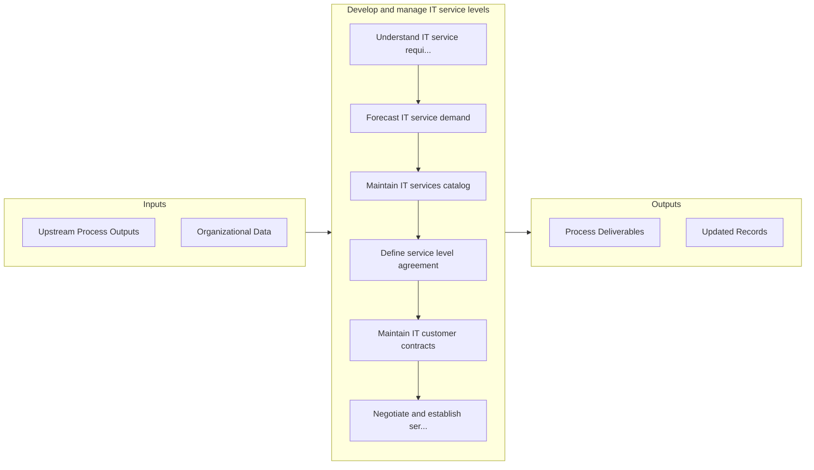

# Develop and manage IT service levels

> Establishing and maintaining service levels for the provision of IT services and solutions.

## Overview

Process 8.1.5 is a core process that defines the specific procedures for develop and manage it service levels. 

Establishing and maintaining service levels for the provision of IT services and solutions. Design and maintain the IT services and solution catalogue, as well as service level agreements. Evaluate the performance of IT service level agreements. Communicate the results to the management.

## Process Hierarchy



## Key Statistics

| Metric | Value |
|--------|-------|
| APQC Code | 20632 |
| Hierarchy ID | 8.1.5 |
| Level | Process |
| Parent | [8.1](../) |
| Sub-Processes | 7 |


## GraphDL Semantic Structure

```graphdl
develop.AndManageITServiceLevels
```

| Component | Value | Description |
|-----------|-------|-------------|
| Verb | `develop` | Primary action |
| Object | `and manage IT service levels` | Direct object |


## Process Flow



## Sub-Processes

| Process | Hierarchy ID | Description |
|---------|-------------|-------------|
| [Understand IT service requirements](./UnderstandITServiceRequirements) | 8.1.5.1 | Understand requirements related to information technology services considering enterprise-level effe |
| [Forecast IT service demand](./ForecastITServiceDemand) | 8.1.5.2 | Forecasting demand for IT services using current business growth, research, and customer feedback |
| [Maintain IT services catalog](./MaintainITServicesCatalog) | 8.1.5.3 | Maintain information about IT deliverables, prices, contact points, and processes for requesting a s |
| [Define service level agreement](./DefineServiceLevelAgreement) | 8.1.5.4 | Designing and maintaining commitment of service by performance evaluation of IT services and communi |
| [Maintain IT customer contracts](./MaintainITCustomerContracts) | 8.1.5.5 | Maintaining and documenting commitment of service to staff for information technology contracts incl |
| [Negotiate and establish service level agreements](./NegotiateAndEstablishServiceLevelAgreements) | 8.1.5.6 | Establish a service level agreement, which is a negotiated agreement designed to create a common und |
| [Develop and maintain improvement processes](./DevelopAndMaintainImprovementProcesses) | 8.1.5.7 | Conveying the improvement opportunities for the business and level of IT services |


## Related Concepts

- ITServiceLevels
- ITServiceLevels


---

*Source: APQC PCF 20632 (8.1.5) - APQC*
