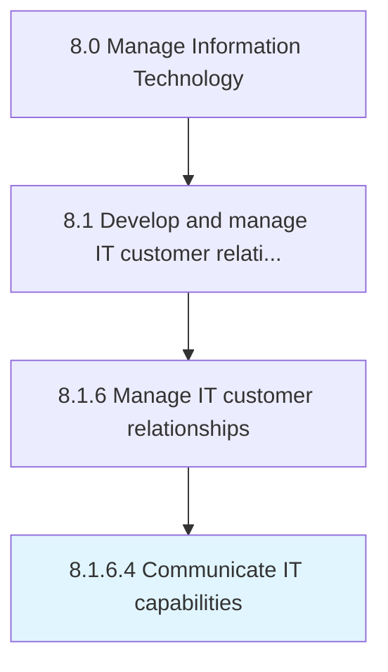

# Communicate IT capabilities

> Conveying the goals and objectives of the IT function and how it contributes to the overall business objectives to staff and departments across the organization.

## Overview

Activity 8.1.6.4 is an activity within the Manage Information Technology framework. 

Conveying the goals and objectives of the IT function and how it contributes to the overall business objectives to staff and departments across the organization.

## Process Hierarchy



## Key Statistics

| Metric | Value |
|--------|-------|
| APQC Code | 20645 |
| Hierarchy ID | 8.1.6.4 |
| Level | Activity |
| Parent | [8.1.6](../) |
| Sub-Processes | 0 |


## GraphDL Semantic Structure

```
communicate.ITCapabilities
```

| Component | Value | Description |
|-----------|-------|-------------|
| Verb | `communicate` | Primary action |
| Object | `IT capabilities` | Direct object |


## Related Concepts

- ITCapabilities


---

*Source: APQC PCF 20645 (8.1.6.4) - APQC*
